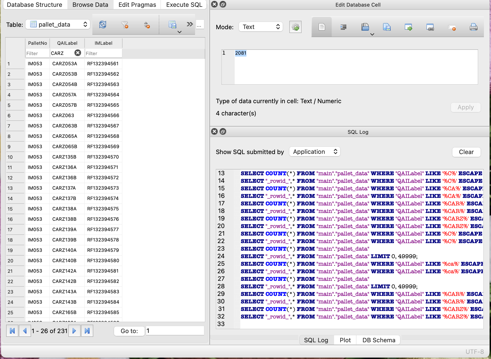

# ACF Pallet Inventory Database Management  

## Overview  
This project automates the creation and updating of an **SQLite database** for managing pallet inventory data extracted from Excel sheets. The system processes historical data (Pallet001 to Pallet417) and seamlessly appends new records by identifying the latest pallet number.  

## Initiative and Impact  
**It originated from a real-world problem: the Excel file used to manage pallet inventory had grown too large to function efficiently. When I heard from my manager that upper management was considering creating a database to address the issue, I took the initiative to apply my skills and develop this solution.**

This project demonstrates my ability to identify and address practical issues in data management. By proactively creating this solution, I provided a scalable approach to handling growing data volumes, saving time and effort for the team while improving operational efficiency.  

## Why SQLite  
The ACF project has accumulated 417 pallets over two years, resulting in a database size of just 557 KB. Since only three variables are relevant for querying (`PalletNo`, `QAILabel`, `IMLabel`), and the data requires local storage, SQLite is an ideal choice. Its lightweight nature and ease of use make it well-suited for the simplicity of the data and query needs.  

For details on scalability and future data handling capabilities, refer to the **[ACF Database Brief Review.pdf](ACF_Database_Brief-Review.pdf)**

## Database Example: DB Browser Interface  

Below is an example of the **DB Browser for SQLite** interface, displaying the database structure, query log, and data browsing features. This interface makes it easy to query, filter, and validate (change, delete, or add entries) the data stored in the SQLite database, with **no prior technical knowledge required**. It fully meets the needs of the ACF project for efficient and user-friendly data management.  

  

## Files  
- **`Create_database_1-417.py`**  
   - Initializes the SQLite database with pallet data from sheets IM001 to IM417.  
   - Processes up to the first 40 rows per sheet.  

- **`Add_newRecords.py`**  
   - Automatically identifies the largest pallet number in the database.  
   - Reads and appends data from the next N sheets (default: 100).  
   - Stops if no further sheets are available.  

- **`ACF_Database_Brief_Review.pdf`**  
   - Documentation explaining the database implementation, scalability, tools used, technical knowledge required, and methods for updating the database.
   - The ACF project prioritizes **simplicity and ease of use**, requiring **no prior technical knowledge**. In this brief review, I explained the advantages of choosing SQLite and provided possilbe approaches for **non-technical users** to efficiently update and manage the database.

## Key Features  
1. **Database Creation**: Reads historical pallet data (IM001 to IM417) from an Excel file and creates a consistent SQLite database.  
2. **Automatic Updates**: Identifies the largest pallet number in the database and appends new records from the Excel file.  
3. **Error Handling**: Gracefully handles missing or non-existent sheets.  
4. **Column Consistency**: Ensures column names match the database schema (`PalletNo`, `QAILabel`, `IMLabel`).  

## Disclaimer
The content in this folder are part of the database project at **Quality Associates Inc.** and are for **demonstration purposes only**. 
Any unauthorized use, reproduction, or distribution may result in a violation of copyright laws and will be subject to appropriate actions.

_**By accessing this folder, you agree to adhere to all copyright policies.**_
