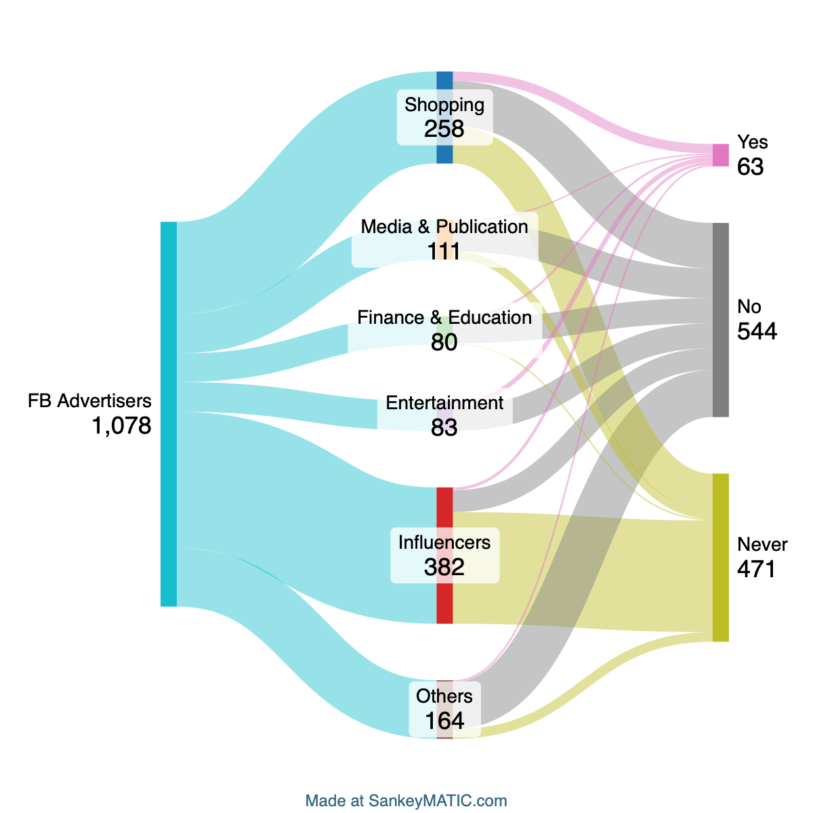

# Project 1: Facebook Data Analysis

## Overview

This project examines how social media platforms like **Facebook** collect and use user data for targeted advertising. By analyzing **three years of personal Facebook advertising data**, the study categorizes advertisers, evaluates data accuracy, and explores regulated domains. It reflects on data privacy concerns and offers strategies to better understand and manage interactions on social media.

---

## Learning Outcomes
- Analyzed personal Facebook advertising data to understand advertising profiles.
- Gained insights into data accuracy and its implications for user privacy.
- Developed a critical perspective on regulated domains and social media data collection.

---

## Key Findings

1. **Advertiser Categories**:
   - Data was grouped into six main categories: **Shopping**, **Media & Publication**, **Finance & Education**, **Influencers**, **Entertainment**, and **Others**.
   - **Shopping** and **Influencers** had the most advertisers but also the highest irrelevant content.
   - **Entertainment** had the most accurate advertising with zero irrelevant content.

2. **Data Accuracy**:
   - Accuracy ranged from **35.7%** to **82.11%** across categories.
   - **Entertainment** demonstrated the highest accuracy, while **Influencers** had the most irrelevant content.

3. **Regulated Domains**:
   - Domains such as **Credit**, **Education**, **Employment**, and **Housing** were identified.
   - Advertisers included **TBC Bank**, **Zenith Prep Academy**, **LinkedIn**, and **Zillow**.

4. **Reflection on Privacy**:
   - Facebook's data collection raised privacy concerns, especially in predicting private traits from minimal interactions (e.g., gifting baseball gear).
   - Highlighted the need for caution in social media interactions to minimize unnecessary exposure of personal information.

---

### Summary Statistics Table
| **Category**           | **Accuracy (%)** | **Rubbish (%)** |
|-------------------------|------------------|---------------------|
| Shopping               |  10.5            | 40.3             |
| Media & Publication    |   3.6            | 20.7             |
| Finance & Education    |   7.5            |  5.0             |
| Influencers            |   2.1            | 81.9             |
| Entertainment          |  15.7            |  0.0             |
| Others                 |   3.1            | 16.5             |

### Dataflow Diagram

---

## Reflection

Through this analysis, I developed a better understanding of:
1. The implications of **data accuracy** for user privacy.
2. How minimal actions on social media (e.g., gifting) can lead to predictions of private traits.
3. The importance of exercising caution when interacting with social media platforms.

---

## Files
- For more details, refer to the **[P1_report.pdf](P1_report.pdf)**.
