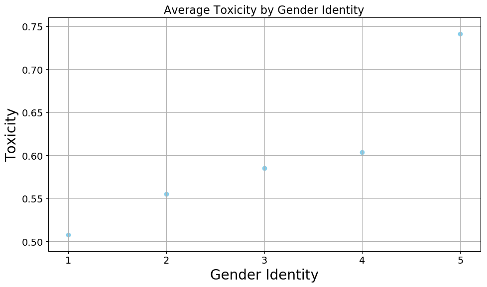
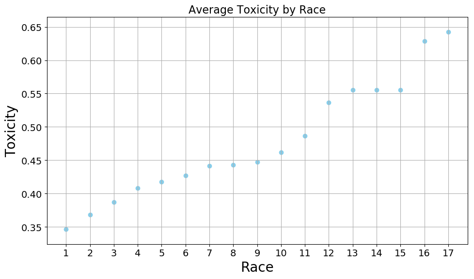
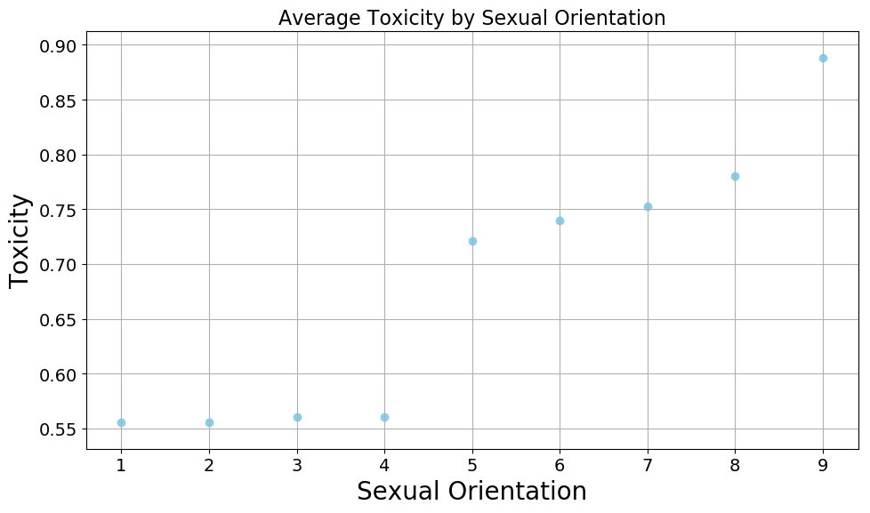

# Project 3: Toxicity Analysis in Protected Classes

## Overview

This project analyzes relationships between protected class variables and toxicity levels in comments from **Wikipedia Talk Pages**. By examining correlations between attributes like **Gender Identity**, **Race**, and **Religion** with toxicity, the study evaluates potential biases in toxicity labeling and explores methods to measure and mitigate bias in AI systems.

---

## Learning Outcomes
- Identified correlations between protected classes and toxicity levels using statistical measures.
- Investigated bias in natural language data and its implications for AI fairness and ethics.
- Assessed how sampling methods affect representation and measurement in data subsets.

---

## Key Findings

1. **Protected Classes and Subgroups**:
   - Subgroups were categorized into six protected classes: **Gender Identity**, **Sexual Orientation**, **Race**, **Religion**, **Age**, and **Disability**.
   - Example subgroups:
     - **Gender Identity**: Male, Female, Nonbinary, Transgender.
     - **Disability**: Blind, Deaf, Paralyzed.
     - **Race**: Black, White, Hispanic, Asian.

2. **Toxicity Correlations**:
   - **Highest Correlations**: **Sexual Orientation**, **Race**, and **Gender Identity** showed weak correlations with toxicity levels.
   - **Lowest Correlations**: **Age** and **Disability** had very weak correlations with toxicity.

3. **Bias in Subgroup Toxicity**:
   - Subgroup **"Blind"** in **Disability** showed the highest toxicity values, potentially due to:
     - Biased data labeling influenced by human perceptions.
     - Offensive usage of the term "blind" in derogatory contexts.
   - Subgroups **"Deaf"** and **"Paralyzed"** in **Disability** exhibited the lowest toxicity values, attributed to their neutral or descriptive usage.

4. **Sampling Impact**:
   - Random sampling of 10% and 50% datasets preserved toxicity distributions across most protected classes.
   - Smaller sample sizes led to noticeable selection bias and reduced representativeness of subgroups like **Disability**.

---

## Visualizations

### Correlation Coefficients Table
| **Protected Class**    | **Toxicity Correlation** | **Correlation Strength** |
|-------------------------|--------------------------|---------------------------|
| Gender Identity         | 0.241                   | Weak                      |
| Sexual Orientation      | 0.273                   | Weak                      |
| Race                    | 0.252                   | Weak                      |
| Religion                | 0.112                   | Very Weak                 |
| Age                     | 0.084                   | Very Weak                 |
| Disability              | 0.051                   | Very Weak                 |

### Toxicity by Protected Class Subgroups
**1. Gender Identity**  

**2. Race**  

**3. Sexual Orientation**  

---

## Reflection

- **Bias in Data**:
  - Toxicity values reflect human bias in data labeling, particularly against subgroups like **"Blind"** in Disability.
  - Offensive contexts amplify toxicity for specific terms, highlighting societal biases embedded in datasets.
- **Ethical Implications**:
  - Bias in toxicity labeling has significant implications for AI fairness, leading to potential discrimination in automated systems.
  - Addressing these biases requires neutral toxicity assessment frameworks, robust data selection processes, and regular evaluations.

---

## Files
- **`P3.py`**: Code for statistical analysis and visualization of toxicity data.
- **`toxicity_per_attribute.csv`**: Dataset of Wikipedia Talk Page comments and associated attributes.
- For more details, refer to the **[P3_report.pdf](P3_report.pdf)**.
