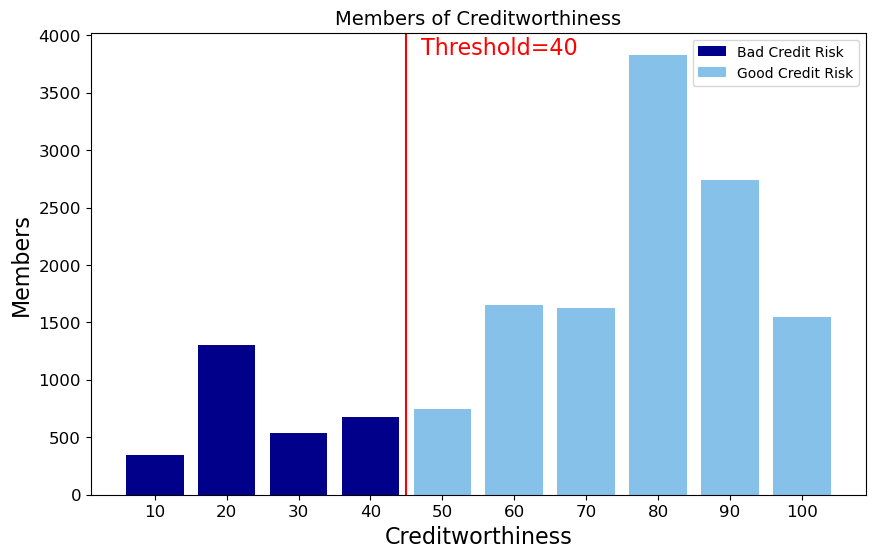
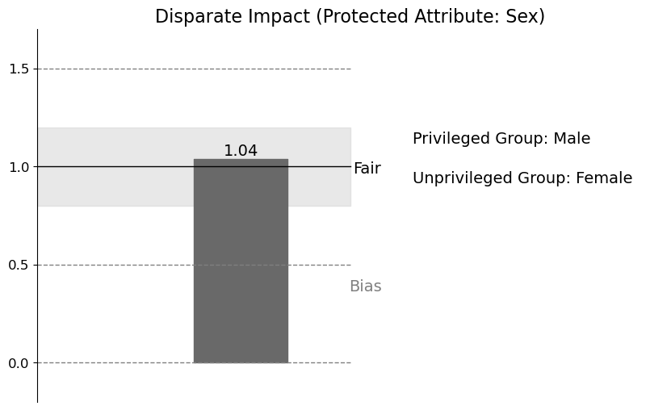
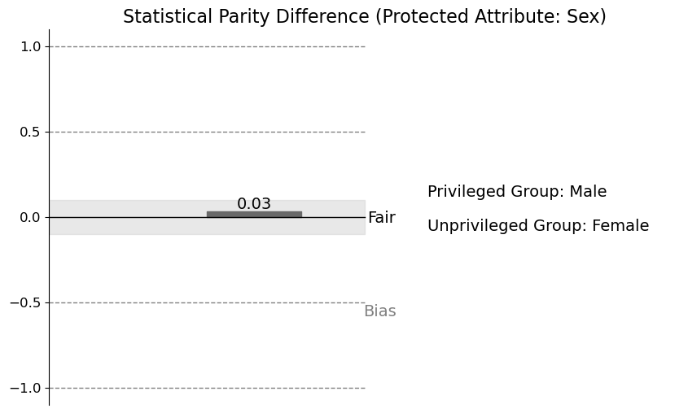

# Project 5: Fairness and Bias in Credit Decisions

## Overview

This project evaluates fairness and bias in credit decision-making using the **Taiwan Credit Dataset**. By analyzing legally protected class variables such as **Age**, **Gender**, and **Marital Status**, the study assesses bias using fairness metrics like **Disparate Impact (DI)** and **Statistical Parity Difference (SPD)**. The project further explores bias mitigation strategies by adjusting decision thresholds for privileged and unprivileged groups to balance fairness and profitability.

---

## Learning Outcomes
- Investigated bias in credit decisions through fairness metrics.
- Assessed how different thresholds impact fairness and profitability in credit approval.
- Explored trade-offs between fairness and financial outcomes in bias mitigation.

---

## Key Findings

1. **Protected Class Analysis**:
   - **Gender**: Male as the privileged group, Female as the unprivileged group.
   - **Fairness Metrics**: 
     - **Disparate Impact (DI)**: Measures the ratio of favorable outcome rates between groups.
     - **Statistical Parity Difference (SPD)**: Measures the difference in favorable outcome rates between groups.

2. **Bias Analysis**:
   - **DI**: 1.04 (acceptable range: 0.8–1.2), suggesting no distinctive bias.
   - **SPD**: 0.03 (acceptable range: -0.1 to 0.1), indicating no distinctive bias.

3. **Bias Mitigation**:
   - Different thresholds for loan approval were applied:
     - Privileged Group Threshold: 20
     - Unprivileged Group Threshold: 30
   - Results:
     - DI changed to 0.983, within the acceptable range.
     - Profit increased from 114,905 to $112,169 while maintaining fairness metrics.

4. **Trade-offs**:
   - Lowering thresholds for unprivileged groups improves fairness but may elevate financial risks.
   - Applying different thresholds raises concerns about reverse discrimination.

---

### Distribution of Creditworthiness with One Threshold

### Fairness Metrics DI & SDP

---

## Reflection

- **Fairness Metrics**:
  - Both DI and SPD highlight existing disparities in credit decisions, emphasizing the need for fairness considerations in financial algorithms.
  - Bias mitigation using thresholds may improved fairness while preserving profitability.

- **Challenges**:
  - Bias mitigation methods, such as setting different thresholds, risk introducing new biases or perceptions of reverse discrimination.
  - Overcorrection may lead to approving loans for individuals with higher default risks, potentially compromising long-term financial stability.

---

## Files
- **`P5.py`**: Code for implementing bias analysis, fairness metrics, and bias mitigation strategies.
- For more details, refer to the **[P5_report.pdf](P5_report.pdf)**.
