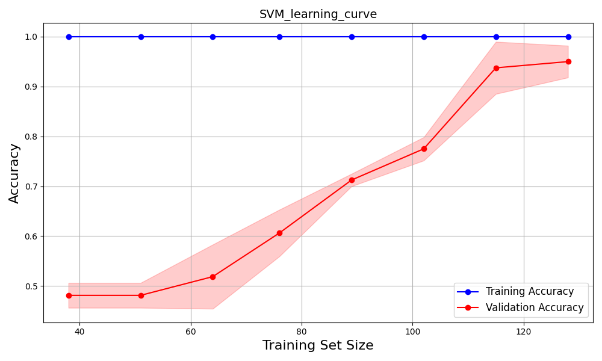
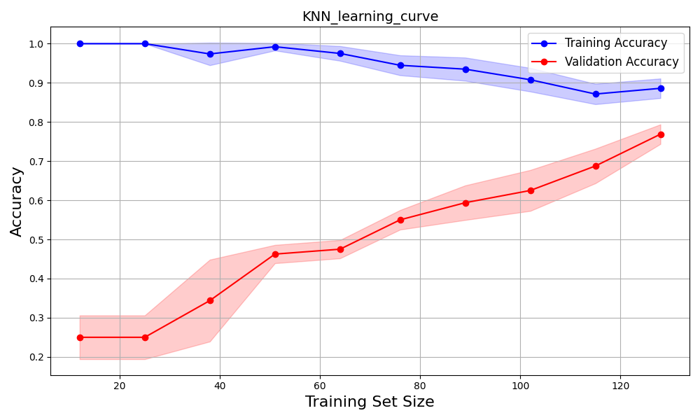
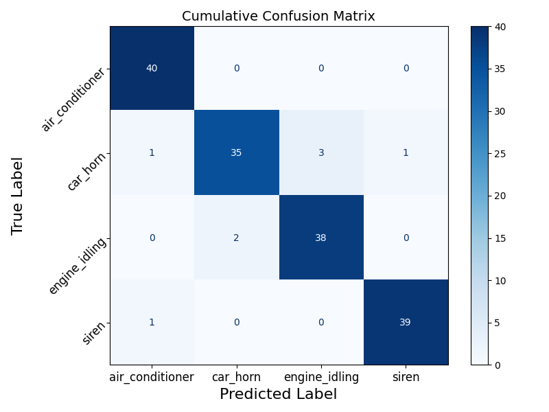

# Audio Challenge Project: Audio Classification with SVM and KNN

## Overview

This project evaluates the performance of **Support Vector Machines (SVM)** and **K-Nearest Neighbors (KNN)** for classifying environmental sounds. The dataset comprises four categories: **Air Conditioner**, **Car Horn**, **Engine Idling**, and **Siren**. 

To improve audio quality and feature extraction:
- **Noise reduction techniques** (Wavelet Transform, Spectral Gating, Bandpass Filtering) were applied.
- **Mel-Frequency Cepstral Coefficients (MFCCs)** were extracted as input features.

Key performance metrics include **accuracy**, **precision**, **recall**, and **F1-score**. SVM outperformed KNN in accuracy and generalization but incurred higher computational costs.

---

## Methods

### Dataset
- **Classes**: Air Conditioner, Car Horn, Engine Idling, and Siren.
- **Size**: 160 total samples (40 per class), each 4 seconds in duration.
- **Balance**: The dataset is balanced with no missing values.

### Noise Reduction
Three denoising techniques were compared using untuned linear SVM:
| Denoising Method       | Accuracy |
|------------------------|:--------:|
| Spectral Gating        | 0.79     |
| Wavelet Transform      | 0.88     |
| Bandpass Filtering     | 0.96     |

**Bandpass Filtering** was selected for superior performance.

### Feature Engineering
- **MFCCs**: Extracted and scaled as input features to the models.
- 13 MFCCs per audio sample.

### Algorithms
1. **Support Vector Machines (SVM)**: Linear kernel with Grid Search for hyperparameter tuning.
2. **K-Nearest Neighbors (KNN)**: Tuned using Grid Search on `n_neighbors` and `weights`.

### Experiment Setup
- **5-fold Cross-Validation** for evaluation.
- **Learning Curves** to study generalization performance.
- **Confusion Matrices** to analyze class-level performance.

---

## Key Results

### SVM (Support Vector Machine)
**Learning Curve**:  

**Cumulative Confusion Matrix**:  

- **Accuracy**: 0.969
- **Precision**: 0.972
- **Recall**: 0.968
- **F1-Score**: 0.968

SVM achieved excellent performance, particularly for **Air Conditioner** and **Engine Idling**, due to their distinct frequency patterns.

---

### KNN (K-Nearest Neighbors)
**Learning Curve**:  

**Cumulative Confusion Matrix**:  

- **Accuracy**: 0.950
- **Precision**: 0.959
- **Recall**: 0.944
- **F1-Score**: 0.945

KNN performed well but struggled with **Car Horn** due to overlapping features with other classes.

---

## Wall Clock Time Comparison

| Model | Testing Time (seconds) |
|-------|:----------------------:|
| SVM   | 3.44                   |
| KNN   | 1.17                   |

SVM had a higher computational cost due to its quadratic optimization process.

---

## Conclusion

This study demonstrates the effectiveness of SVM and KNN for **audio classification**:
- **SVM** achieved higher accuracy and robust generalization, making it suitable for small balanced datasets.
- **KNN** was computationally efficient but slightly underperformed due to feature overlap.

---

## Future Work

1. **Improved Feature Extraction**: Explore Mel-Spectrograms and Chroma features.
2. **Resampling**: Standardize audio sample rates across classes.
3. **Advanced Models**: Apply **CNNs** or ensemble methods for complex datasets.
4. **Error Analysis**: Address misclassifications through hybrid models or better hyperparameter tuning.

---

## Files

- **`Audio_Challenge.py`**: Code for data preprocessing, model training, and evaluation.
- For further details, refer to the **[Audio_Challenge_Report.pdf](Audio_Challenge_Report.pdf)**.

---

## Disclaimer
The content in this folder are part of the project challenge at **Reality AI, Renesas** and are for **demonstration purposes only**. 
Any unauthorized use, reproduction, or distribution may result in a violation of copyright laws and will be subject to appropriate actions.

_**By accessing this folder, you agree to adhere to all copyright policies.**_
