# Bayesian Project: Robust and Ensemble Regression

## Overview

This project explores **robust regression techniques** and **ensemble methods** to mitigate the impact of outliers in regression models. Using a synthetic dataset with a linear trend, Gaussian noise, and significant outliers, the performance of **frequentist linear regression**, **Bayesian robust models**, and **Bayesian Additive Regression Trees (BART)** is evaluated.

Key performance metrics include **Median Absolute Error (MedAE)**, **Leave-One-Out Cross Validation (LOO)**, and **Widely Applicable Information Criterion (WAIC)**.

---

## Methods

### Dataset
- **Data**: A synthetic dataset with:
  - **110 samples** containing a linear trend.
  - Gaussian noise and **9% outliers**.
- **True Regression Line**:
  \[
  y = 2 + 3x
  \]
- Outliers were randomly added to simulate real-world anomalies.

**Scatter Plot**:  
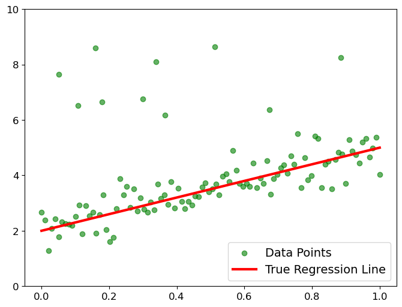

### Models
Six regression models were implemented and evaluated:
1. **Frequentist Linear Regression**
2. **Standard Bayesian Linear Regression** (Gaussian Likelihood)
3. **Robust Bayesian Linear Regression** (Student-t Likelihood)
4. **Mixture Bayesian Linear Regression** (Mixture Model for Outlier Detection)
5. **Standard BART** (Bayesian Additive Regression Trees)
6. **Robust BART** (BART with Student-t Likelihood)
7. **Mixture BART** (BART with Mixture Models)

---

## Key Results

### 1. Frequentist Linear Regression
- Impacted by outliers, producing a **flattened regression line**.
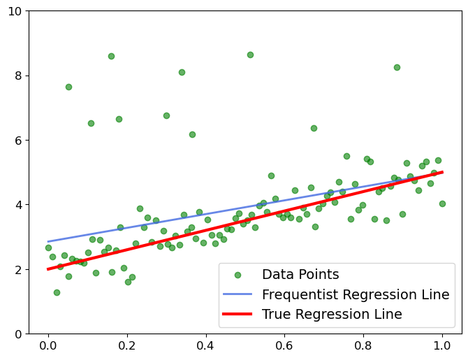

- **Metrics**:  
  - MedAE = **0.534** (largest error).

---

### 2. Standard Bayesian Linear Regression
**Model Structure**:  
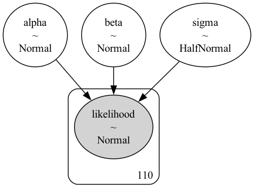

- Captures uncertainty with **Gaussian likelihood**.  
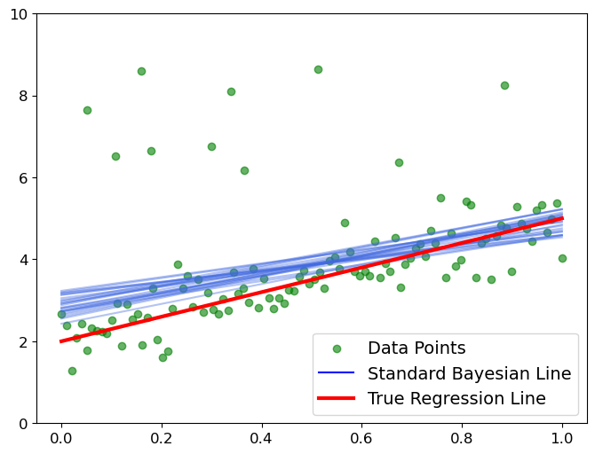

- **Metrics**:  
  - MedAE = **0.522**

---

### 3. Robust Bayesian Linear Regression
**Model Structure**:  
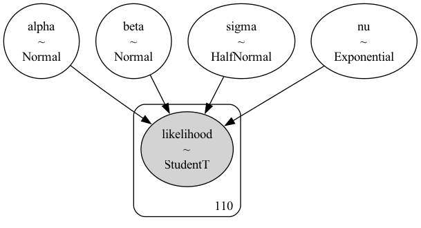

- Improved performance using **Student's t-distribution** for robustness.  
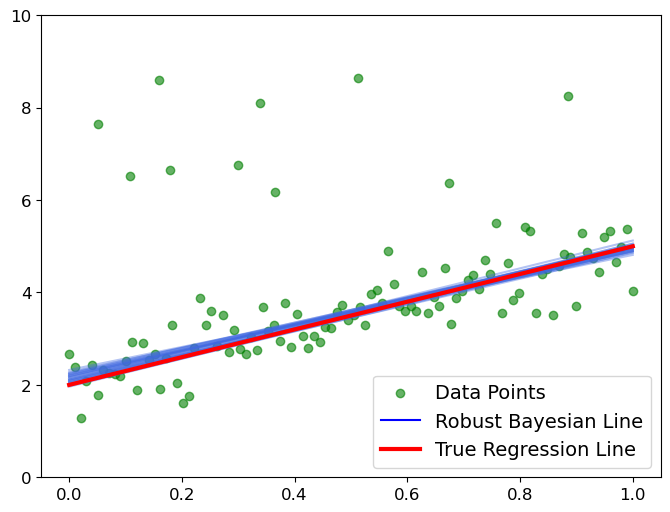

- **Metrics**:  
  - MedAE = **0.380**

---

### 4. Mixture Bayesian Linear Regression
**Model Structure**:  
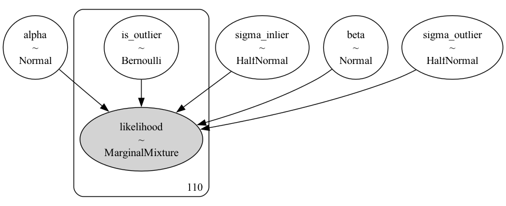

- Explicitly models outliers with **higher variance**.  
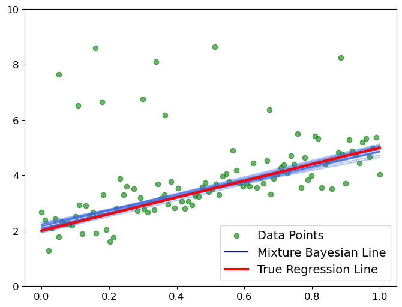

- **Metrics**:  
  - MedAE = **0.325** (second-best).

---

### 5. Standard BART
**Model Structure**:  
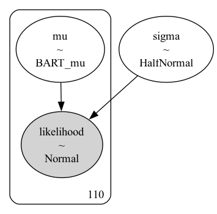

- Captures non-linear trends but remains sensitive to outliers.  
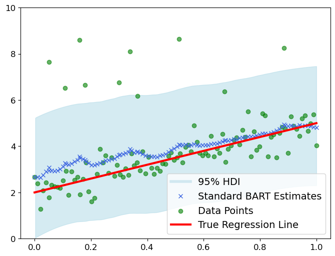

- **Metrics**:  
  - MedAE = **0.491**

---

### 6. Robust BART
**Model Structure**:  
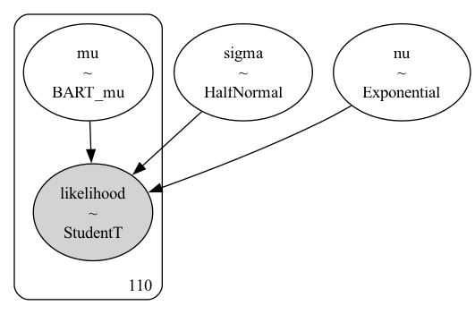

- Incorporates **Student's t-distribution** to manage outliers.  
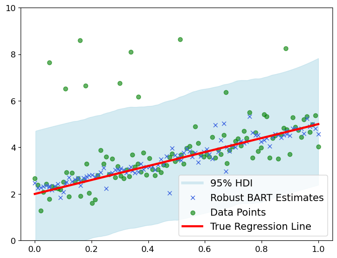

- **Metrics**:  
  - MedAE = **0.340**

### 7. Mixture BART
**Model Structure**:  

- Assigns outliers explicitly using a **mixture model**.  
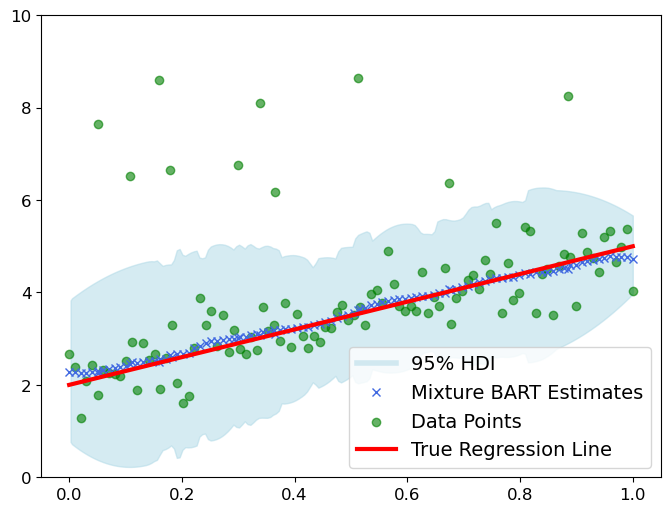

- **Metrics**:  
  - MedAE = **0.313** (best performance).

---

## Metrics Comparison (LOO and WAIC are on log scale)

| Model                  | MedAE | LOO Score | LOO SE | WAIC Score | WAIC SE |
|------------------------|-------|-----------|--------|------------|---------|
| Frequentist            | 0.534 | -         | -      | -          | -       |
| Standard Bayesian      | 0.522 | -191.49   | 15.42  | -191.44    | 15.40   |
| Robust Bayesian        | 0.380 | -137.30   | 15.99  | -137.29    | 15.99   |
| Mixture Bayesian       | 0.325 | -107.26   | 9.95   | -107.02    | 9.96    |
| Standard BART          | 0.491 | -187.11   | 14.92  | -187.07    | 14.90   |
| Robust BART            | 0.340 | -144.20   | 15.55  | -144.15    | 15.55   |
| Mixture BART           | 0.313 | -114.17   | 9.80   | -112.38    | 9.66    |

---

## Conclusion

This project demonstrates the effectiveness of **robust techniques** (e.g., Student-t likelihood, Mixture Models) and **ensemble methods** (BART) for mitigating the impact of outliers. Key findings include:
1. **Mixture BART** emerged as the **best-performing model**, achieving the lowest MedAE and superior WAIC/LOO scores.
2. **Mixture Bayesian** performed comparably well, balancing precision and robustness.
3. Robust methods consistently outperformed **Standard Bayesian** and **Frequentist models**.

---

## Files

- **`Project.py`**: Code for implementing and evaluating regression models.
- For additional insights, refer to the **[Project_Report.pdf](Project_Report.pdf)**.

---

## Disclaimer
The content in this folder are part of the coursework at **Georgia Tech** and are for **demonstration purposes only**. 
Any unauthorized use, reproduction, or distribution may result in a violation of copyright laws and will be subject to appropriate actions.

_**By accessing this folder, you agree to adhere to all copyright policies.**_
