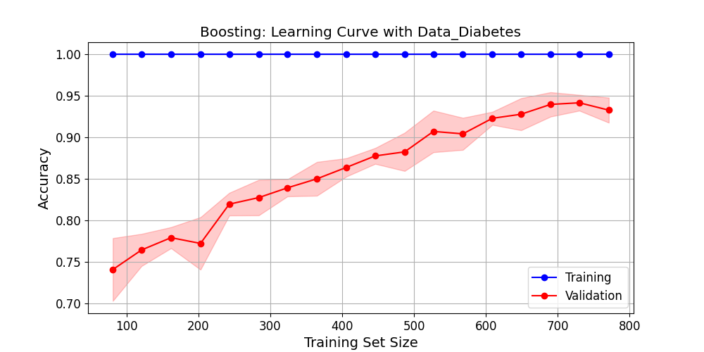

# Project 1: Supervised Learning

## Overview

This project explores the performance of **five supervised learning algorithms** on binary classification tasks. Using two datasets with distinct characteristics, the project evaluates model behavior under varying levels of complexity, data balance, and noise. Key performance metrics include **accuracy**, **precision**, **recall**, and computational efficiency.

---

## Methods

### Datasets
  1. **Data1 (Diabetes)**: Moderate size (1270 samples) with 8 features and a binary target.
  2. **Data2 (Sleepiness)**: Larger and noisier (3200 samples) with 10 features and a binary target.
     - Pre-processing included:
       - **Normalization** to ensure consistent feature scaling.
       - **Under-sampling** to address class imbalance.

### Algorithms
  1. Decision Trees (DT)
  2. Gradient Boosting (GB)
  3. k-Nearest Neighbors (kNN)
  4. Neural Networks (NN)
  5. Support Vector Machines (SVM)

- **Experiment Setup**:
  - Data split into **80% training** and **20% testing**.
  - **5-fold cross-validation** applied for tuning hyperparameters.
  - Grid search used to identify optimal hyperparameters for each model.

---

## Key Results

### Data1 (Diabetes)
- **Best Algorithm**: Support Vector Machines (SVM) achieved the highest accuracy (0.99).
- **Gradient Boosting**: Reduced false positives and showed high generalization with a lower risk of overfitting.
- **kNN**: Efficient but sensitive to irrelevant features, slightly affecting accuracy.
- **Neural Networks**: Struggled due to the dataset size and architectural constraints.

#### Visualizations:

**1. Validation curve for SVM (RBF kernel)**  
RBF kernel achieves the best performance with a regularization parameter (`C`) of 1.
  

**2. Learning curve for Gradient Boosting (Training/Validation Scores)**  
Gradient Boosting achieves high accuracy with a smaller training size, indicating strong generalization.
  

**3. Confusion matrix for k-Nearest Neighbors**  
kNN achieves high recall but slightly lower precision, with minimal false negatives.
  

**4. Loss curve for Neural Networks (Training epochs)**  
The loss steadily decreases over epochs, but underfitting is evident, as validation loss stagnates early.
  

---

### Data2 (Sleepiness)
- **Best Algorithm**: Gradient Boosting (GB) achieved the highest accuracy (0.79) and was robust against noise.
- **kNN**: Accuracy dropped to 0.72, exhibiting significant sensitivity to noise.
- **SVM**: Performed well but showed bias towards false positives (Type I errors).
- **Neural Networks**: Showed underfitting despite extensive hyperparameter tuning.

#### Visualizations:

**1. Validation curve for Gradient Boosting (`n_estimators`)**  
Increasing the number of estimators improves performance, with optimal results achieved at 20 estimators.
  

**2. Validation curve for SVM (Regularization Parameter `C`)**  
Higher values of `C` improve accuracy but increase overfitting, with an optimal value around 10.
  

**3. Learning curve for k-Nearest Neighbors**  
Overfitting is evident with noisy data, as validation performance plateaus with increasing samples.
  

**4. Validation curve for Neural Networks (Regularization Parameter `Alpha`)**  
Lower regularization improves accuracy, but noise in the data prevents the model from generalizing effectively.
  

---

## Accuracy Comparison
| Algorithm          | Data1 (Diabetes) | Data2 (Sleepiness) |
|--------------------|------------------|--------------------|
| Decision Tree      | 0.94             | 0.75               |
| Gradient Boosting  | 0.95             | 0.79               |
| k-Nearest Neighbors| 0.98             | 0.72               |
| Neural Networks    | 0.80             | 0.77               |
| Support Vector Machine | 0.99         | 0.76               |

---

## Conclusion

This project demonstrates the importance of evaluating supervised learning algorithms under different dataset conditions. **Gradient Boosting** emerged as the most robust and efficient model, particularly for noisy datasets. **Support Vector Machines** excelled with high-quality data but were computationally intensive. These findings emphasize the importance of tailoring algorithm selection to specific dataset characteristics.

---

## Files

- **`data/`**: Pre-processed datasets and accompanying instructions.
- **`ML_Algorithms.py`**: Codebase for implementing and tuning algorithms.
- **`ML.py`**: Main script to orchestrate data processing and model evaluation.
- For more details, refer to the **[P1_analysis.pdf](P1_analysis.pdf)**, a detailed report analyzing the performance of the five supervised learning algorithms on the datasets.
