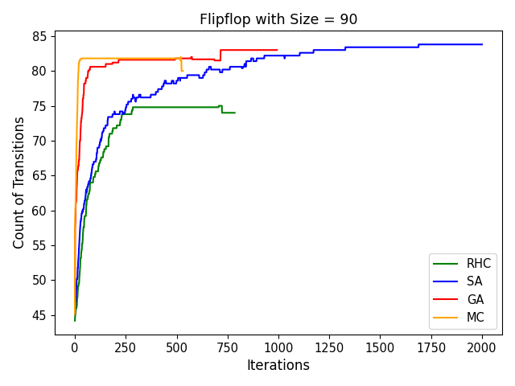

# Project 2: Randomized Optimization

## Overview

This project explores the performance of **four randomized optimization algorithms** applied to three optimization problems and a neural network. The goal is to analyze how these algorithms behave under different problem domains, highlighting their strengths, weaknesses, and trade-offs. The project emphasizes problem-specific algorithm selection, performance tuning, and comparative analysis.

---

## Methods

- **Optimization Algorithms**:
  1. **Randomized Hill Climbing (RHC)**
  2. **Simulated Annealing (SA)**
  3. **Genetic Algorithm (GA)**
  4. **Mutual Information Maximizing Input Clustering (MIMIC)**

- **Optimization Problems**:
  1. **Travelling Salesman Problem (TSP)**: An NP-hard problem for finding the shortest route among cities.
  2. **Knapsack Problem**: A resource allocation problem aiming to maximize value while adhering to weight constraints.
  3. **Flipflop Problem**: An artificial problem maximizing alternating 0s and 1s in a binary string.
  
- **Neural Network Experiment**:
  - **Dataset**: Diabetes dataset (8 features, 1,270 samples, reused from Project 1).
  - **Algorithms Compared**: RHC, SA, GA, and Backpropagation (BP).
  - Performance metrics include **accuracy**, **runtime**, and **convergence**.

- **Evaluation Metrics**:
  - Fitness scores, function evaluations, runtime, accuracy, and learning curves.

- **Experiment Setup**:
  - Problems evaluated at small, medium, and large sample sizes.
  - Results averaged across five random seeds, with standard deviations reported.

---

## Key Results

### Optimization Problems

#### Travelling Salesman Problem (TSP)

**Key Insights**:
- GA consistently achieves the highest fitness score, with minimal variance.
- MIMIC converges the fastest but has the lowest fitness score and highest computational cost.

#### Visualizations:

**1. Fitness Score vs. Problem Size**  
GA performs best across problem sizes, while MIMIC struggles as complexity increases.  

**2. Fitness Score vs. Iterations**  
GA reaches peak fitness after 1,400 iterations, while MIMIC converges within 500 iterations.  

---

#### Knapsack Problem

**Key Insights**:
- MIMIC demonstrates rapid convergence and achieves the highest fitness score.
- SA exhibits significant variability due to temperature fluctuations.

#### Visualizations:

**1. Fitness Score vs. Problem Size**  
MIMIC and GA outperform RHC and SA, with consistent performance across sizes.  

**2. Fitness Score vs. Iterations**  
MIMIC converges within 30 iterations, while GA stabilizes after 300 iterations.  

---

#### Flipflop Problem

**Key Insights**:
- SA achieves the highest fitness score with minimal function evaluations.
- RHC underperforms compared to SA, GA, and MIMIC.

#### Visualizations:

**1. Fitness Score vs. Problem Size**  
SA excels in larger problem sizes, while RHC consistently lags.  

**2. Fitness Score vs. Iterations**  
GA and MIMIC converge rapidly, while SA achieves a higher fitness score over time.  

---

### Neural Network Experiment

**Key Insights**:
- RHC with multiple restarts achieves the highest accuracy (0.819), outperforming BP.
- GA requires the fewest epochs for loss convergence but has the longest runtime.

#### Visualizations:

**1. Accuracy Comparison**  
RHC demonstrates the best performance, followed by SA and GA.  

**2. Training Time Comparison**  
GA exhibits the longest training time, while SA is the fastest.  

**3. Loss Curve for RHC**  
RHC gradually plateaus after 500 epochs, reflecting effective parameter tuning.  

---

## Conclusion

This project demonstrates the importance of tailoring optimization algorithms to specific problem domains:
- **Travelling Salesman Problem (TSP)**: GA excels in complex search spaces, balancing exploration and exploitation.
- **Knapsack Problem**: MIMIC leverages probabilistic modeling for efficient convergence.
- **Flipflop Problem**: SA's stochastic nature efficiently balances exploration and exploitation.
- **Neural Network Optimization**: RHC achieves the highest accuracy, while SA and GA provide robust global optimization capabilities.

Fine-tuning parameters and adding more samples significantly impact algorithm performance, indicating areas for future work.

---

## Files

- **`NN/`**:
  - `NNCompare.py`: Implements neural network optimization experiments.
  - `NNcompare_run.py`: Main script for executing experiments.
  - `Data_Diabetes.csv`: Dataset for neural network optimization.
- **`3Problems/`**:
  - `ML_Knapsack.py`: Solves the Knapsack problem.
  - `ML_TSP.py`: Solves the TSP.
  - `ML_Flipflop.py`: Solves the Flipflop problem.
  - `Problems.py`: Shared utilities and problem definitions.
- **`README.txt`**: Instructions for running the code.
- **`requirement.txt`**: Required Python libraries.
- For more details, refer to the **[P2_analysis.pdf](P2_analysis.pdf)**, a detailed report analyzing the performance of the five supervised learning algorithms on the datasets.
