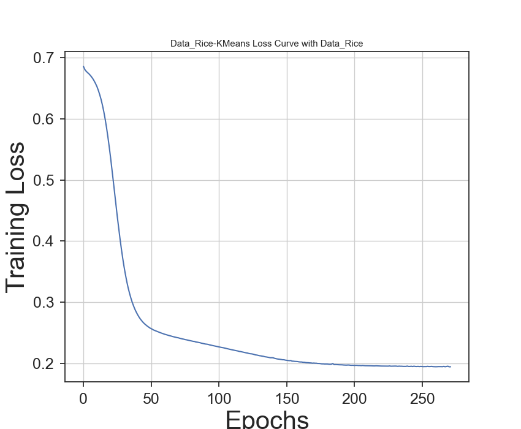

# Project 3: Unsupervised Learning and Dimensionality Reduction

## Overview

This project explores **clustering** and **dimensionality reduction** techniques to understand their performance on datasets with varying collinearity and outliers. The effects of clustering and dimensionality reduction on **neural network performance** are also analyzed.

---

## Methods

### Datasets
1. **Data1 (Diabetes)**: 
   - 8 features, 1,932 samples.
   - Weak collinearity and significant outliers.
2. **Data2 (Rice)**:
   - 7 features, 3,810 samples.
   - Strong collinearity and balanced distribution.

### Algorithms
1. **Clustering**:
   - Expectation Maximization (EM)
   - K-Means
2. **Dimensionality Reduction**:
   - Principal Component Analysis (PCA)
   - Independent Component Analysis (ICA)
   - Sparse Random Projection (SRP)
   - Isomap (IMP)
3. **Neural Networks**:
   - Trained on dimensionality-reduced data and cluster-enhanced data.

### Evaluation Metrics
- Silhouette scores, reconstruction errors, F1 scores, accuracy, and neural network loss curves.

---

## Key Results

### Clustering Performance
- **K-Means** outperformed EM, especially on **balanced datasets** like **Data2**.
- **EM** handled **imbalanced data** better but introduced more clusters.

**1. Silhouette Score for K-Means (Data2)**  
K-Means achieves the best clustering results for Data2 with `k=2`.  
  

**2. Clustering Heatmap for EM and K-Means (Data2)**  
K-Means produces two well-separated clusters, while EM’s soft clustering introduces more overlap.  
  

---

### Dimensionality Reduction Performance
- **PCA** and **ICA** excel with Data2 due to its **strong collinearity**.
- **IMP** outperformed linear methods with **weak collinearity** in Data1.
- **SRP** struggled with noisy data.

**3. PCA: Cumulative Explained Variance (Data2)**  
PCA reduces dimensions to 3 while retaining 100% variance in Data2.  
  

**4. IMP Reconstruction Error (Data2)**  
IMP achieves optimal performance with 3 components for Data2, effectively preserving non-linear structures while minimizing reconstruction error.  

---

### Neural Network Performance
- Neural networks trained on **cluster-enhanced data** showed improved performance.
- **Dimensionality reduction** simplified models but increased computational overhead.

**5. NN Learning Curve with IMP (Data2)**  
Adding samples reduces overfitting and improves generalization.  
  

**6. NN Loss Curve for K-Means (Data2)**  
K-Means-reduced data demonstrates steady convergence, with training loss stabilizing after 150 epochs.  

---

## Accuracy Comparison
| **Method**            | **Data1 F1 Score** | **Data2 F1 Score** |
|------------------------|-------------------|-------------------|
| PCA                   | 0.67              | 0.92              |
| ICA                   | 0.77              | 0.93              |
| SRP                   | 0.60              | 0.92              |
| IMP                   | 0.70              | 0.93              |

---

## Conclusion

- **K-Means** consistently outperformed EM, particularly with balanced datasets.
- **PCA** and **ICA** excelled with **strongly collinear** data (Data2), while **IMP** performed well with non-linear structures (Data1).
- Dimensionality reduction improved neural network efficiency, with **cluster-enhanced datasets** achieving the highest performance.

Fine-tuning the parameters and increasing dataset size further improved clustering and supervised learning performance.

---

## Files

- **`data/`**: Contains datasets, instructions for running the code (`README.txt`), and required Python libraries (`requirement.txt`).
- **`code/`**:
   - `DR.py`: Implements dimensionality reduction techniques (PCA, ICA, SRP, Isomap).
   - `Cluster.py`: Clustering algorithms (EM, K-Means).
   - `NNDR.py`: Neural network evaluation on reduced data.
   - `NNCluster.py`: Neural network evaluation on cluster-enhanced data.
   - `ClusterDR.py`: Combines clustering and dimensionality reduction.
   - `A3_run.py`: Main script for running experiments.
- For more details, refer to the **[P3_analysis.pdf](P3_analysis.pdf)**, a detailed report analyzing the performance of the five supervised learning algorithms on the datasets.
