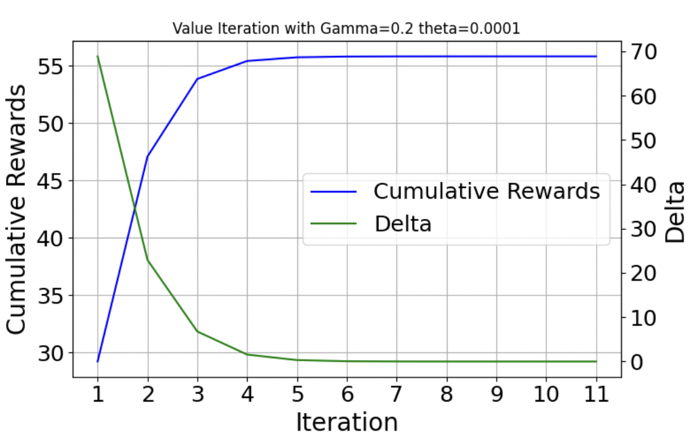
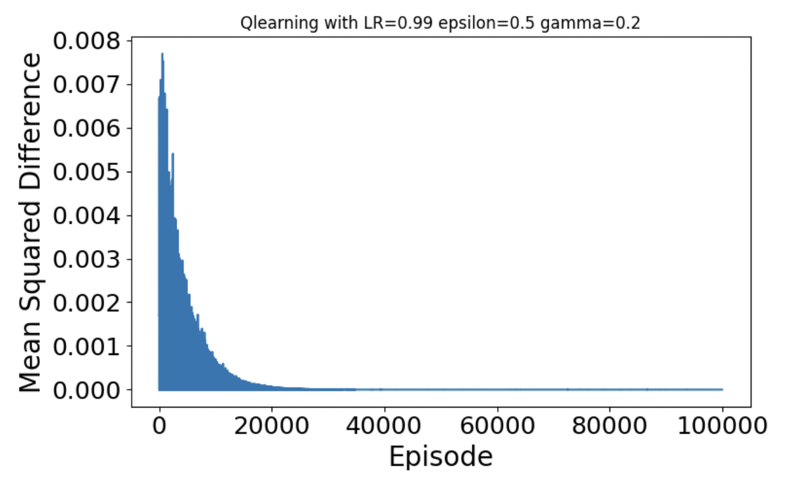
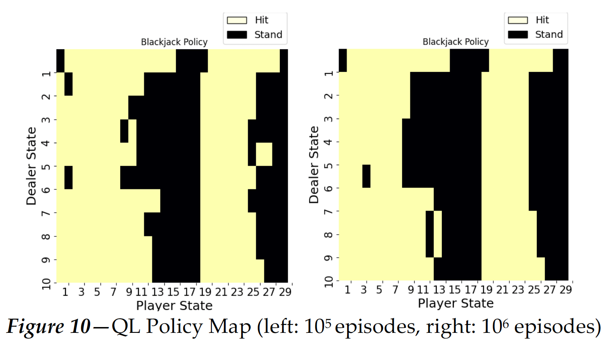
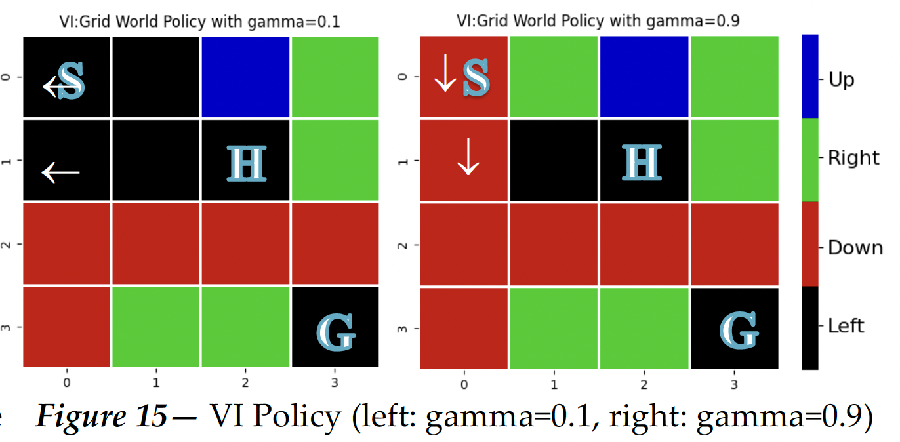
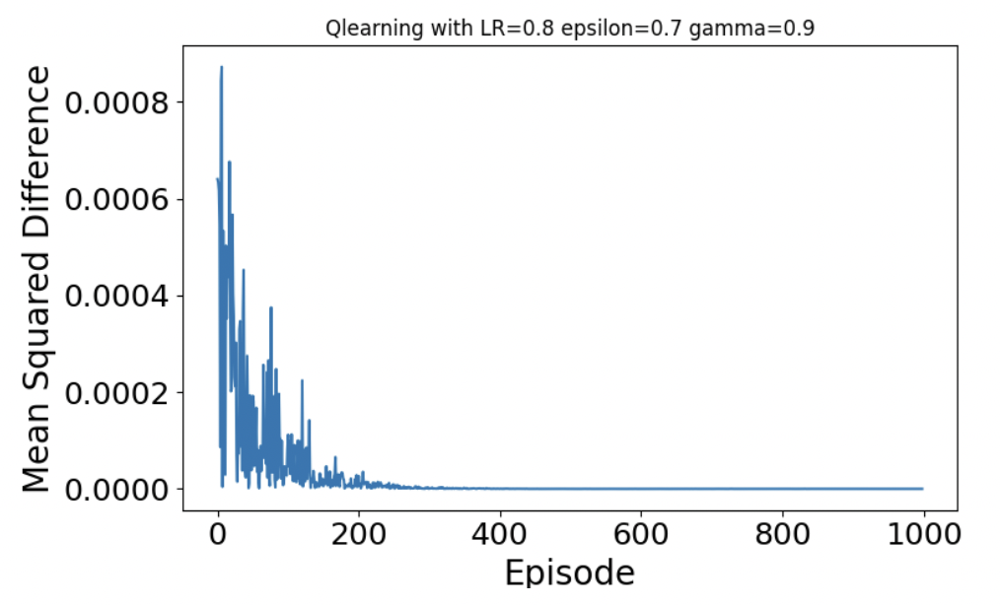
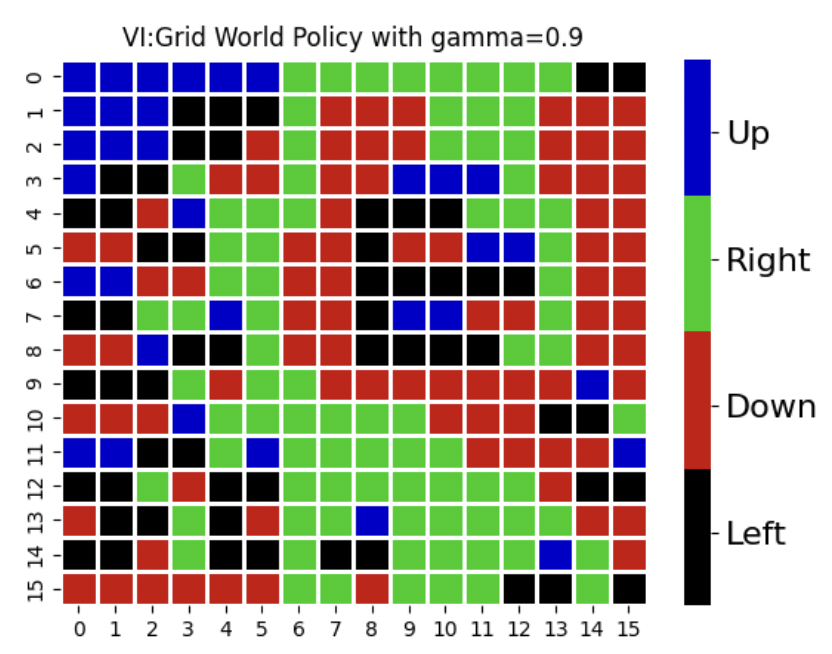
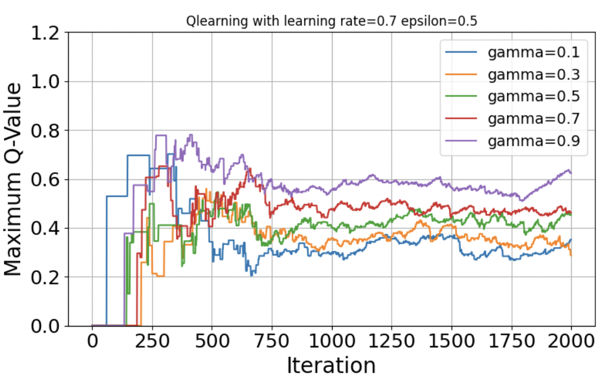

# Project 4: Reinforcement Learning

## Overview

This project explores the application of reinforcement learning algorithms to two environments: **Blackjack** and **Frozen Lake**. The goal is to implement, evaluate, and compare different approaches, focusing on **policy iteration**, **value iteration**, and **Q-learning**. Results are analyzed based on **policy convergence**, **runtime**, and **reward maximization**.

---

## Methods

### Environments
1. **Blackjack**: A card-based stochastic environment.
2. **Frozen Lake**: A grid-based environment with **deterministic** and **stochastic** conditions.
   - Maps tested: **4x4** (small) and **16x16** (large).

### Algorithms
- **Policy Iteration (PI)**  
- **Value Iteration (VI)**  
- **Q-Learning (QL)**  

### Evaluation Metrics
- **Convergence speed**  
- **Policy stability**  
- **Reward maximization**  

---

## Key Results

### Blackjack
- **Best Algorithm**: **Policy Iteration (PI)** achieved faster convergence with minimal parameter tuning.  
- **Q-Learning**: Effective but required more episodes and careful parameter tuning.  

**1. Value Iteration Convergence (Blackjack)**  
Value Iteration converges within 10 iterations with a small discount factor (`gamma = 0.2`).  

**2. Q-Learning Convergence (Blackjack)**  
Q-Learning requires approximately 20,000 episodes for convergence under tuned parameters.  

**3. Policy Map Comparison**  
Both Value Iteration and Q-Learning converge to similar policies after sufficient episodes.  

---

### Frozen Lake

#### 4x4 Map
- **Best Algorithm**: **Policy Iteration** achieved optimal policies with lower computational costs.  
- **Q-Learning**: Required more time but converged to similar policies.

**1. Value Iteration Policy Map (4x4)**  
Value Iteration produces optimal policies, efficiently navigating the agent towards the goal.  

**2. Q-Learning Convergence (4x4)**  
Q-Learning converges within 200 episodes after tuning (`LR=0.8`, `epsilon=0.7`, `gamma=0.9`).  

---

#### 16x16 Map
- **Challenges**: Sparse rewards and large state space increase computational costs.  
- **Q-Learning**: Faced difficulty balancing exploration and exploitation.

**3. Value Iteration Policy Map (16x16)**  
Optimal policies require more iterations but converge with a high discount factor (`gamma = 0.9`).  

**4. Q-Learning Parameter Sensitivity (16x16)**  
Higher learning rates and exploration rates are critical for Q-Learning in large environments.  

---

## Conclusion

- **Model-based algorithms** (Value Iteration, Policy Iteration) converge faster in environments with known dynamics.  
- **Q-Learning** demonstrates flexibility but requires careful parameter tuning and more episodes for convergence.  
- Large environments (e.g., 16x16 Frozen Lake) highlight the challenges of scaling reinforcement learning algorithms due to sparse rewards and increased state space.

---

## Files

- **code/**:
  - `blackjack-envP.py`: Custom implementation of the Blackjack environment.
  - `VIPI-blackjack.py`: Policy and Value Iteration for Blackjack.
  - `QL-blackjack.py`: Q-Learning for Blackjack.
  - `frozen_lake.py`: Custom Frozen Lake environment.
  - `VIPI-frozenlake.py`: Policy and Value Iteration for Frozen Lake.
  - `QL-frozenlake.py`: Q-Learning for Frozen Lake.
  - `plots.py`: Generates plots for analysis.
- **README.txt**: Instructions for running the code.  
- **requirement.txt**: List of required Python libraries.
- For more details, refer to the **[P4_analysis.pdf](P4_analysis.pdf)**, a detailed report analyzing the experiments
