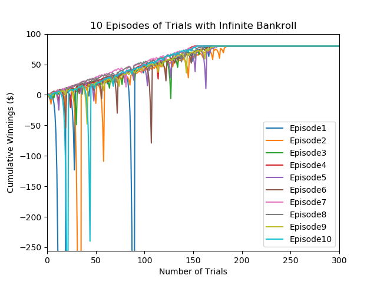
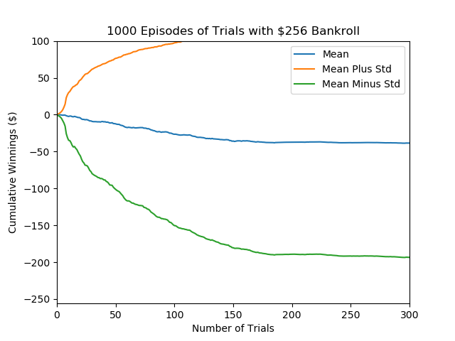

# Project 1: Martingale Strategy Simulation

## Overview
This project explores the Martingale betting strategy applied to an American Roulette wheel. The strategy involves doubling the bet after a loss and resetting it to the initial amount after a win. Two scenarios were tested using Monte Carlo simulations:
1. **Infinite Bankroll**: Simulates the ideal case with unlimited funds.
2. **Limited Bankroll ($256)**: Introduces a cap on losses, reflecting real-world constraints.

---

## Methods
- **Simulation**: Each simulation consisted of 1000 sequential bets, repeated across 1000 episodes.
- **Betting Strategy**: Start with an initial bet of $1:
  - **After a loss**: Double the bet.
  - **After a win**: Reset to $1.
  - Stop betting once the cumulative winnings reach $80 (success) or -$256 (failure in limited bankroll).
- **Roulette Odds**: A 47.4% win rate (18 black numbers out of 38 total).

---

## Key Results
### Infinite Bankroll
- **Winning Probability**: 100% chance of reaching the $80 goal within 1000 bets.
- **Expected Value**: $80.
- **Observations**: 
  - On average, 169 bets were needed to reach the goal, with all episodes achieving it within 215 bets.
  - Extreme losses were observed in some episodes before recovery, occasionally dropping below -$10,000. The following plot illustrates the cumulative winnings for a sample of episodes:

This plot demonstrates the consistency of reaching the $80 goal despite large intermittent losses, made possible by the infinite bankroll.

---

### Limited Bankroll ($256)
- **Winning Probability**: 63.8% chance of reaching the $80 goal.
- **Expected Value**: -$40.
- **Observations**:
  - Many episodes terminated at -$256 due to the bankroll limit, which prevented recovery from large losses.
  - Smoother trends in cumulative winnings were observed due to the restriction on extreme losses. The plot below showcases the outcomes across episodes:

This plot highlights the risks introduced by a limited bankroll, where losses often cap at -$256, leading to a lower probability of success.

---

## Discussion
- The **infinite bankroll** scenario demonstrates the theoretical strengths of the Martingale strategy, highlighting its ability to recover from losses, albeit at the cost of requiring unlimited funds.
- The **limited bankroll** simulation reflects realistic constraints, showing how the strategy's risks can lead to significant financial losses.

### Benefits of Expected Values
Expected values provide a concise measure of outcomes but do not capture rare, extreme losses, which are critical in real-world scenarios.

---

## Files
- **`martingale.py`**: Python script implementing the Martingale strategy simulation.
- For more details, refer to the **[martingale_report.pdf](martingale_report.pdf)**, which is the detailed report including comprehensive methodology, results, and analysis.
