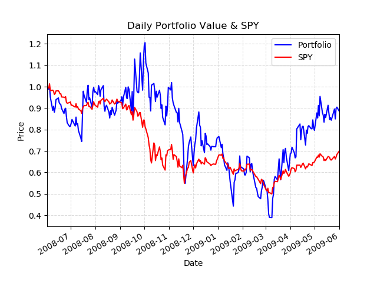

# Project 2: Optimize Something

## Overview
This project focuses on optimizing a stock portfolio to maximize the **Sharpe Ratio**, a measure of risk-adjusted return. The goal is to determine the optimal stock allocations for a given set of stocks while adhering to specified constraints and leveraging optimization techniques.

### Objectives
1. **Metrics Implementation**: 
   - Develop code to calculate portfolio performance metrics such as:
     - **Cumulative Return**
     - **Average Daily Return**
     - **Sharpe Ratio**
2. **Portfolio Optimization**:
   - Use the SciPy optimization library to determine the stock allocations that maximize the Sharpe Ratio.
   - Compare the optimized portfolio’s performance against a benchmark (SPY).

---

## Methods
- **Data Normalization**: Daily portfolio values are normalized to facilitate comparisons.
- **Performance Metrics**: The code calculates risk-adjusted returns using the Sharpe Ratio formula:  
  `Sharpe Ratio = (Average Daily Return - Risk-Free Rate) / Standard Deviation of Daily Return`
  
- **Optimization**:
  - Constraints: The sum of stock allocations equals 1.
  - Objective Function: Maximize the Sharpe Ratio.
  - Algorithm: Leverages SciPy's `minimize` function to find optimal allocations.

---

## Key Results
The optimized portfolio achieved higher risk-adjusted returns compared to SPY, as shown in the plot below:

- **Observation**: The optimized portfolio consistently outperformed SPY during the evaluation period (June 2008 to June 2009), showcasing the effectiveness of the Sharpe Ratio optimization approach.

---

## Discussion
This project demonstrates the practical application of optimization techniques in portfolio management. The results highlight the importance of:
- Choosing appropriate performance metrics.
- Using optimization to tailor stock allocations to specific investment goals.

The project also emphasizes reproducibility and clarity in code implementation, ensuring accurate assessments and comparisons.

---

## Files
- **`optimization.py`**: Python script implementing data normalization, portfolio performance metrics, and the optimization function.
