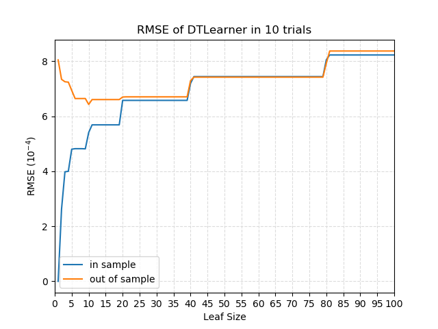
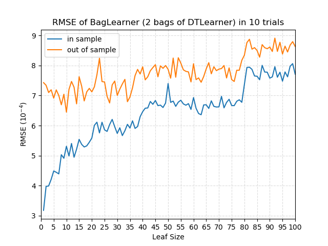
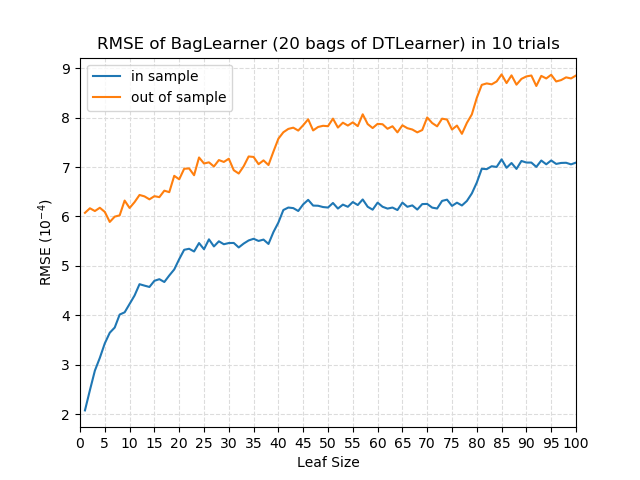
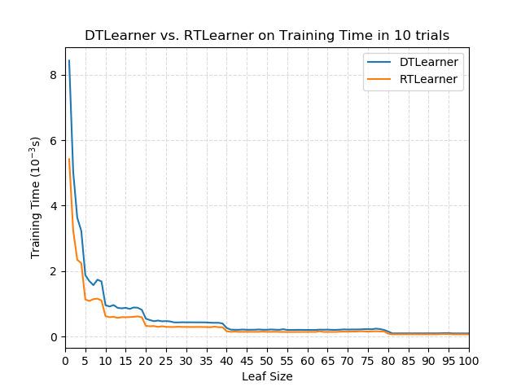
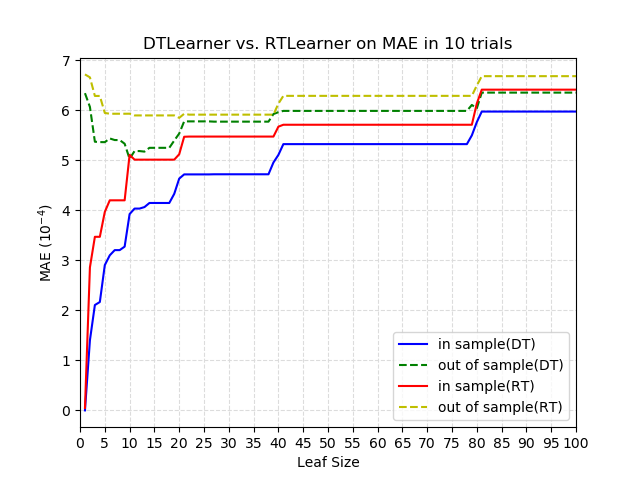
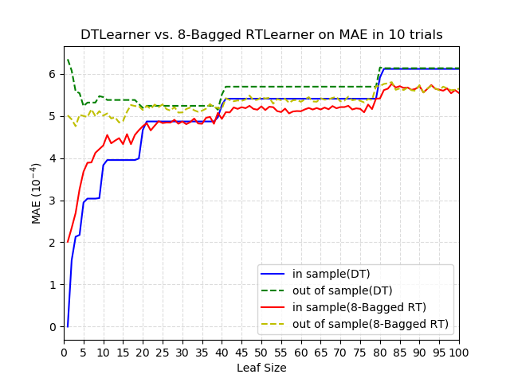

# Project 3: Assess Learners

## Overview
This project evaluates the performance of different machine learning algorithms for regression tasks. Specifically, it compares a **Decision Tree Learner (DTLearner)**, a **Random Tree Learner (RTLearner)**, and a **Bagged Learner**. The project explores key concepts like overfitting, bagging for variance reduction, and trade-offs between training time and accuracy.

---

### Key Objectives
1. Examine the occurrence of overfitting with respect to leaf size.
2. Investigate how bagging can reduce or eliminate overfitting.
3. Compare the performance of DTLearner and RTLearner in terms of accuracy (using metrics like RMSE and MAE) and training time.
4. Evaluate bagged versions of DTLearner or RTLearner.

---

## Methods
1. **DTLearner**: Builds a decision tree by selecting the feature with the highest absolute correlation with the target variable.
2. **RTLearner**: Builds a decision tree with a random feature selection for splits.
3. **BagLearner**: Creates an ensemble of learners by training multiple trees on bootstrap samples of the data.

Performance is evaluated using:
- **Root Mean Square Error (RMSE)**
- **Mean Absolute Error (MAE)**

---

## Key Results

### Experiment 1: Overfitting in DTLearner
Overfitting occurs with DTLearner as the leaf size decreases. The in-sample error approaches 0, but the out-of-sample error increases. This behavior is visualized below:

---

### Experiment 2: Bagging to Reduce Overfitting
Bagging reduces overfitting as the number of bags increases. When using 20 bags, the out-of-sample error decreases, and overfitting tends to reduce. The figures below illustrate this trend:

**2 Bags of DTLearner**  

**20 Bags of DTLearner**  

---

### Experiment 3: DTLearner vs. RTLearner
#### Training Time
RTLearner trains faster than DTLearner due to its random feature selection strategy, as shown in the plot below:

#### Mean Absolute Error (MAE)
Bagged RTLearner achieves smaller out-of-sample errors than DTLearner, demonstrating the benefit of combining bagging with RTLearner.

**MAE of DTLearner vs. RTLearner**  

**MAE of DTLearner vs. 8-Bagged RTLearner**  

---

## Discussion
- **Overfitting**: Both DTLearner and RTLearner are prone to overfitting with small leaf sizes. Bagging effectively mitigates this issue.
- **Bagging**: Improves model generalization by reducing variance and out-of-sample error. However, additional bags beyond a certain point (e.g., 20) provide diminishing returns.
- **Comparison**: While DTLearner is more accurate due to its statistical feature selection, RTLearner is computationally efficient and benefits significantly from bagging.

---

## Files
- **`DTLearner.py`**: Implements a regression tree learner with statistical feature splits.
- **`RTLearner.py`**: Implements a regression tree learner with random feature splits.
- **`BagLearner.py`**: Implements an ensemble learner using bagging.
- **`InsaneLearner.py`**: Combines multiple Bagged Learners for experimentation.
- **`testlearner.py`**: Conducts experiments and evaluates learners' performance.
- **`assesslearners_report.pdf`**: Detailed report analyzing learners' performance, including results, charts, and discussions on overfitting, bagging, and runtime efficiency.
