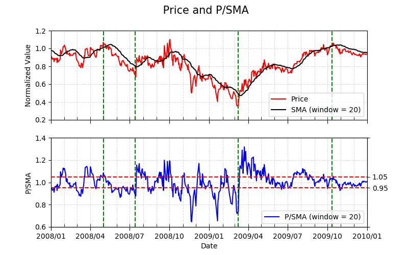

# Project 6: Theoretically Optimal Strategy and Technical Indicators

## Overview
This project evaluates the performance of a **Theoretically Optimal Strategy (TOS)** and explores five technical indicators for predicting stock price movements. The TOS significantly outperformed a benchmark strategy, achieving 6.7 times higher profit. Technical indicators were developed to generate buy and sell signals, helping identify overbought and oversold conditions in the market.

---

## Key Objectives
1. Implement a **Theoretically Optimal Strategy (TOS)** to maximize profit.
2. Develop and analyze five technical indicators:
   - Price/SMA Ratio (P/SMA)
   - Price Rate of Change (ROC)
   - Golden/Death Cross (GDC)
   - Bollinger Bands (BB)
   - Percentage Price Oscillator (PPO)
3. Compare the performance of TOS with a buy-and-hold benchmark strategy.
4. Evaluate the effectiveness of technical indicators for predicting stock trends.

---

## Methods

### Theoretically Optimal Strategy (TOS)
- **Design**: TOS assumes perfect knowledge of future price trends. It trades 1000 shares long when the price is expected to rise and 1000 shares short when the price is expected to drop.
- **Benchmark**: A buy-and-hold strategy, holding 1000 shares for the entire timespan (2008–2009).
- **Result**: TOS achieved a final portfolio value of $678,610 compared to the benchmark’s $101,230, as illustrated below:

*Table 1: Performance Comparison*
| Name       | Cumulative Return | Mean Daily Return | Std Dev of Daily Return |
|------------|--------------------|-------------------|--------------------------|
| TOS        | 5.786             | 0.003817          | 0.004548                 |
| Benchmark  | 0.0123            | 0.000168          | 0.017004                 |

---

### Technical Indicators
1. **Price/SMA Ratio (P/SMA)**:  
   A detrended form of the Simple Moving Average (SMA).  
   - **Thresholds**:  
     - Buy signal: P/SMA < 0.95  
     - Sell signal: P/SMA > 1.05  

   

2. **Price Rate of Change (ROC)**:  
   A momentum oscillator measuring percentage change in price.  
   - **Thresholds**:  
     - Buy signal: ROC crosses above 0  
     - Sell signal: ROC crosses below 0  

   

3. **Golden/Death Cross (GDC)**:  
   Based on the crossover of the 15-day EMA (short-term) and 50-day SMA (long-term).  
   - **Thresholds**:  
     - Buy signal: GDV index = -1 (local minimum)  
     - Sell signal: GDV index = 1 (local maximum)  

   

4. **Bollinger Bands (BB)**:  
   Uses an SMA line with upper and lower bands 2 standard deviations above and below SMA.  
   - **Thresholds**:  
     - Buy signal: BBV < -1  
     - Sell signal: BBV > 1  

   

5. **Percentage Price Oscillator (PPO)**:  
   A momentum indicator showing the difference between two EMAs (12-day and 26-day).  
   - **Thresholds**:  
     - Buy signal: PPO crosses above signal line  
     - Sell signal: PPO crosses below signal line  

   

---

## Discussion
1. **Theoretically Optimal Strategy (TOS)**:
   - Outperformed the benchmark by a factor of 6.7.
   - Demonstrated the theoretical upper bound of performance.

2. **Technical Indicators**:
   - P/SMA and PPO were the most effective indicators for capturing market trends.
   - All indicators lagged the price change, highlighting the importance of combining multiple indicators.

3. **Trade-Offs**:
   - Adjusting indicator thresholds and window sizes can enhance performance but may introduce more false signals.
   - Combining indicators reduces risks of misclassification but increases complexity.

---

## Files
- **`indicators.py`**: Implements five technical indicators and their thresholds.
- **`marketsimcode.py`**: Simulates trades and computes portfolio value for a given strategy.
- **`TheoreticallyOptimalStrategy.py`**: Implements the TOS.
- **`testproject.py`**: Tests the TOS and technical indicators on sample data.
- **`indicatorsTOS_report.pdf`**: Detailed report analyzing the results of TOS and technical indicators.
