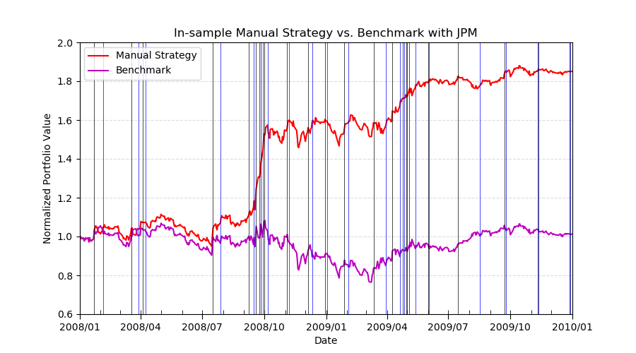
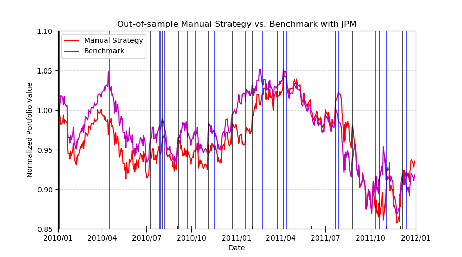
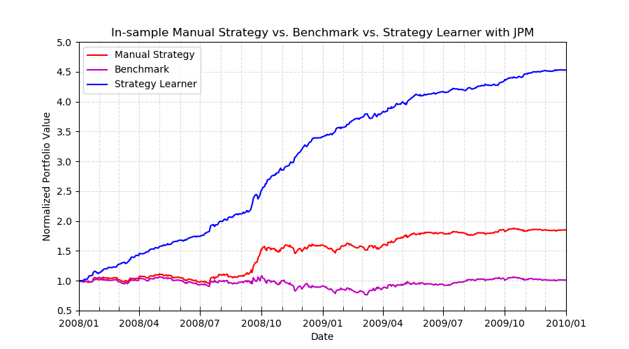
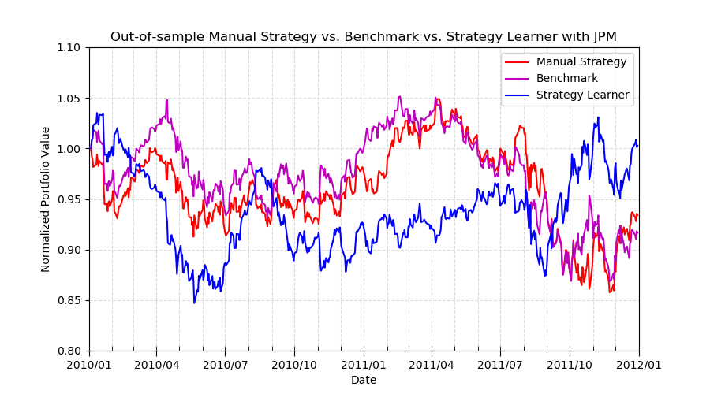
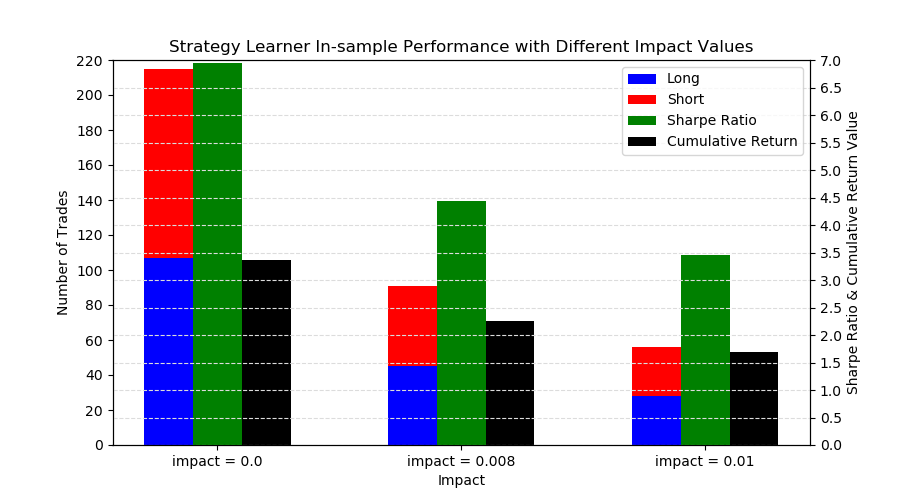
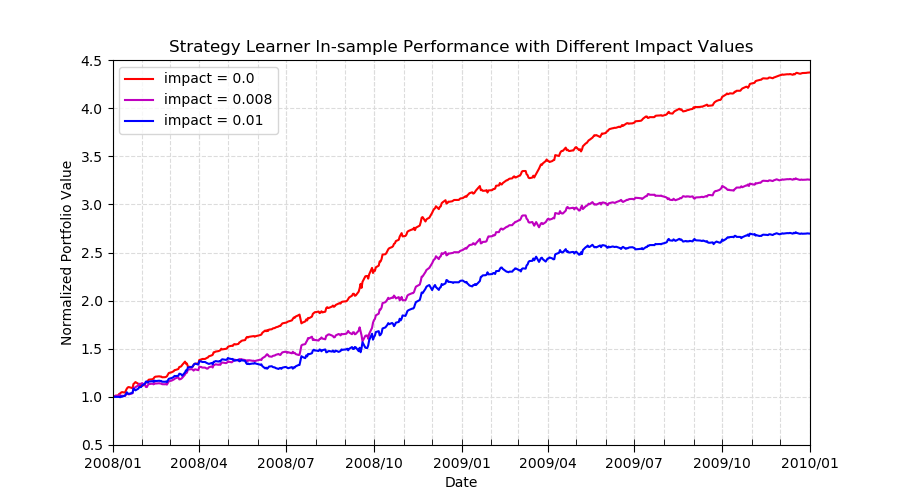

# Project 8: Strategy Evaluations

## Overview
This project implements and evaluates two trading strategies:
1. **Manual Strategy (MS)**: Combines technical indicators to signal buy/sell actions.
2. **Learner Strategy (LS)**: Uses a Random Forest classifier trained on technical indicators to make trading decisions.

Both strategies are tested against a benchmark buy-and-hold strategy. The project explores the performance of these strategies under varying conditions, including different impact values.

---

## Key Objectives
1. Implement and evaluate **Manual Strategy (MS)** using three technical indicators:
   - Price/SMA Ratio (P/SMA)
   - Price Rate of Change (ROC)
   - Bollinger Bands (BB)
2. Implement and evaluate **Learner Strategy (LS)**, leveraging supervised learning techniques.
3. Compare the performance of MS, LS, and the benchmark across in-sample and out-of-sample periods.
4. Analyze the impact of transaction costs and market impacts on strategy performance.

---

## Methods
1. **Manual Strategy (MS)**:
   - Combines three indicators (P/SMA, ROC, BB) to generate trading signals.
   - Uses predefined thresholds tuned for optimal in-sample performance.

   **In-sample Results**:  
   MS achieved a final portfolio value 1.8 times higher than the benchmark during the in-sample period.  
   

   **Out-of-sample Results**:  
   MS slightly outperformed the benchmark during the out-of-sample period, despite negative returns overall.  
   

2. **Learner Strategy (LS)**:
   - Implements a Random Forest classifier to predict trading actions based on indicators.
   - Uses discretized returns (positive, negative, or neutral) as the target variable for training.

   **In-sample Results**:  
   LS outperformed both MS and the benchmark, achieving a Sharpe Ratio of 7.43 and a final portfolio value of $452,923.  
   

   **Out-of-sample Results**:  
   LS was more volatile out-of-sample but still outperformed MS and the benchmark.  
   

---

## Experiment 2: Impact Analysis
Impact values were varied to analyze their effect on LS performance. As the impact increased, the number of trades and profits decreased:

- **Trades and Sharpe Ratio**:
  

- **Portfolio Values with Different Impacts**:
  

---

## Discussion
1. **Manual Strategy**:
   - Effective in outperforming the benchmark but limited by fixed thresholds.
   - Negative returns in the out-of-sample period highlight its lack of adaptability.

2. **Learner Strategy**:
   - Combines ensemble learning with technical indicators for robust performance.
   - In-sample peeking advantage led to outstanding results, but it still performed well out-of-sample.

3. **Impact of Transaction Costs**:
   - Higher transaction costs (impact) reduced both the number of trades and cumulative returns, underscoring the importance of minimizing costs.

4. **Indicator Effectiveness**:
   - The combination of indicators was carefully tuned, but adding more indicators did not guarantee better performance.

---

## Files
- **`ManualStrategy.py`**: Implements the Manual Strategy using three technical indicators.
- **`StrategyLearner.py`**: Implements the Learner Strategy with a Random Forest classifier.
- **`indicators.py`**: Defines and calculates the technical indicators used in both strategies.
- **`marketsimcode.py`**: Simulates trading actions and computes portfolio value for a given strategy.
- **`experiment1.py`**: Runs and evaluates strategies for Experiment 1 with fixed transaction costs.
- **`experiment2.py`**: Runs and evaluates strategies for Experiment 2 with varying impact values.
- **`testproject.py`**: Validates the functionality of strategies and related modules.
- For more details, refer to the **[strategyEval_report.pdf](strategyEval_report.pdf)**, a comprehensive report analyzing the performance of both strategies, including statistical results and discussions.
