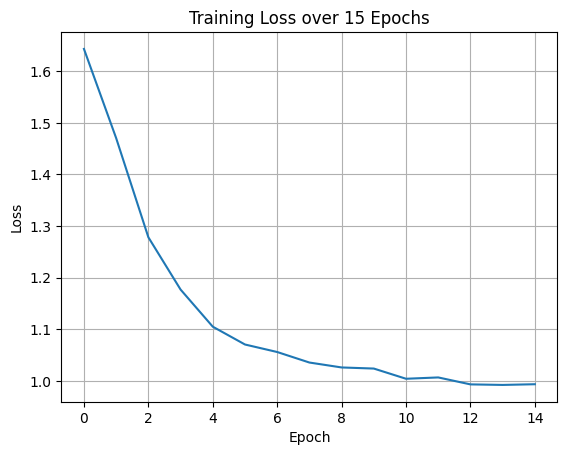
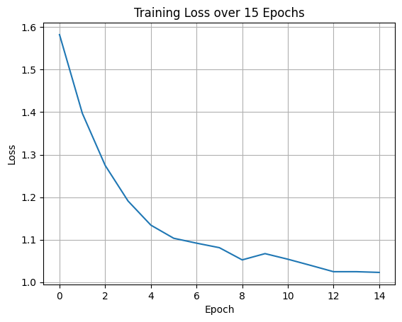

# KVMemNet Project: Question Answering with Key-Value Memory Networks

## Overview

This project implements and evaluates a **Key-Value Memory Network (KVMemNet)** model for a question-answering task. The model is trained on a real dataset containing key-value fact pairs and associated questions, aiming to retrieve correct answers based on attention over stored facts.

Two model configurations are compared:
- **Multihot Baseline**: A simple memory representation using multihot encoding of keys and values.
- **GloVe Embedding Model**: A learned embedding representation initialized with pre-trained GloVe vectors.

Key performance metrics include **accuracy** and **training loss**. The GloVe embedding model outperformed the multihot baseline in both accuracy and generalization.

---

## Methods

### Dataset
- **Structure**: Each example consists of:
  - A set of **facts** stored as `(key, value)` pairs.
  - A **query** in natural language.
  - A **target answer** from one of the values.
- **Training augmentation**: Two random persons are added to each memory to simulate distractors.

### Preprocessing
- **Multihot encoding**: Each word index is encoded as a binary vector for the baseline.
- **GloVe embeddings**: Pre-trained GloVe vectors map words to dense 100-dimensional embeddings.
- **Vocabulary**: Built from the dataset to map each unique token to an integer ID.

### Model Architecture
1. **Embedding Layers**:
   - **embedding_A**: Projects keys into the query space.
   - **embedding_B**: Projects values into the answer space.
2. **Attention Mechanism**:
   - Dot-product attention between the query and all keys.
   - Softmax over attention scores.
3. **Answer Prediction**:
   - Weighted sum of value embeddings.
   - Inner product with candidate answer embedding to compute final scores.

### Training Setup
- **Loss Function**: Cross-entropy loss over possible answers.
- **Optimizer**: Adam with learning rate scheduling.
- **Batching**: Processes one person at a time (no mini-batching).
- **Epochs**: Fixed number (no early stopping).
- **Metrics**: Accuracy and loss per epoch.
- **Implementation**: PyTorch.

---

## Key Results

### Multihot Baseline
**Training Loss Curve**:  

- **Testing Accuracy**: ~73%
- **Observation**: Learns basic retrieval but struggles with distractors.

---

### GloVe Embedding Model
**Training Loss Curve**:  

- **Testing Accuracy**: ~93%
- **Observation**: Stronger semantic matching due to richer word representations.

---

## Comparison of Models

| Model               | Accuracy | Training Time per Epoch (s) |
|---------------------|:--------:|:---------------------------:|
| Multihot Baseline   |    73%   |             44              |
| GloVe Embedding     |    93%   |             52              |

GloVe embeddings significantly improved accuracy with a moderate increase in training time.

---

## Conclusion

This study demonstrates the effectiveness of **Key-Value Memory Networks** for fact-based question answering:
- The **GloVe embedding model** achieved higher accuracy and stronger generalization.
- The **multihot baseline** is simpler and faster but less robust to distractors.

---

## Future Work

1. **Multi-hop Reasoning**: Extend to multiple reasoning steps for more complex queries.
2. **Mini-batching**: Improve training efficiency.
3. **Larger Pre-trained Models**: Experiment with contextual embeddings like BERT.
4. **Noise Robustness**: Test performance with increasing distractor facts.

---

## Files

- **`private_models.py`**: Contains `PrivateModels.KVMemNet` and `PrivateModels.KVMemNet_Embedding`.
  *Note:* This file is kept private for academic integrity.
- **`key_value_memory_network.ipynb`**: Notebook with data prep, training, evaluation, and figures..

---

## Disclaimer
The content (code, report, analyses, writeup, etc.) in this folder are part of the coursework at **Georgia Tech** and are for **demonstration purposes only**. 
Any unauthorized use, reproduction, or distribution may result in a violation of copyright laws and will be subject to appropriate actions.

_**By accessing this folder, you agree to adhere to all copyright policies.**_
