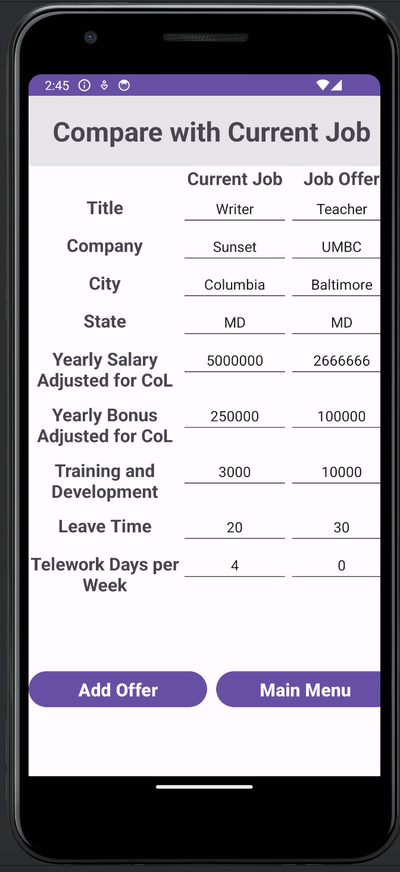

# JobCompare: Job Offer Comparison App

## Overview

**JobCompare** is an Android app designed to help users compare their current job with job offers based on weighted criteria. The project simplifies job evaluation by enabling users to input job details, assign weights to important factors, and view comparisons in an intuitive format.

### My Project Manager Role

This is a **group project** developed by Team 173 for CS6300 Summer 2024. 

As the **project manager**, I led the team in planning, developing, and delivering the project. Responsibilities included:
- Coordinating team efforts and hosting meetings.
- Overseeing design, development, and testing phases.

### My Full-Stack Developer Role
As a **full-stack developer**, I contributed extensively to all deliverables:

- **Deliverable 1**: Completed the individual design section, finalized the `DesignDocument.md`, and reviewed the team design.
- **Deliverable 2**: Built the app framework and key UI components (Main Menu, Current Job UI, Weight Settings UI, Job Offer UI). Implemented `SharedPreferences` for local data storage and created `Job` and `Weight` classes. Supervised development and updated the `DesignDocument.md`.
- **Deliverable 3**: Resolved data storage issues, finalized data retrieval for Job Offer and Compare Job UIs, and completed testing for key features. Transitioned the app to production-ready mode, verified functionalities, and updated the `DesignDocument.md`.

---

## Features

- **Input Current Job Details**: Users can input details about their current job.
- **Input Job Offers**: Add and save multiple job offers for comparison.
- **Adjust Comparison Weights**: Assign weights to factors such as salary, benefits, and location.
- **Compare Jobs**: View a ranked list of jobs and detailed side-by-side comparisons.
- **Data Persistence**: Local storage ensures user data remains intact between sessions.

## Project Details

### Use Cases

1. **Enter Current Job**: Add details about your current job.
2. **Enter Job Offers**: Add and save details for multiple job offers.
3. **Adjust Comparison Settings**: Customize weight preferences for comparison factors.
4. **Compare Job Offers**: Rank and compare jobs based on user-defined weights.

For detailed scenarios, refer to the [Use Case Model](doc/UseCaseModel.md).

### Design and Architecture

- **Technology Stack**:
  - Built using **Android Studio Hedgehog** with **Java 17**.
  - Uses **SharedPreferences** for data persistence.
- **System Environment**:
  - Minimum SDK: Android 13 (API 33).
  - Gradle version: 8.2.
- **Architecture**:
  - `JobManager`: Manages user interactions and navigation.
  - `DataManager`: Handles data storage and retrieval.
  - `JobScore`: Calculates weighted scores for job comparisons.

For more, refer to the [Design Document](doc/DesignDocument.md).

### Testing

- **Unit Testing**: Verifies individual components like `DataManager` and `JobScorer`.
- **Integration Testing**: Ensures smooth interaction between UI and backend components.
- **System Testing**: Validates the app meets all functional requirements.
- **Regression Testing**: Checks that new updates do not affect existing features.

Detailed test cases and results can be found in the [Test Plan](doc/TestPlan.md).

## Development Process

1. **Planning**:
   - Created initial design documents and project plans.
   - Discussed individual UML designs and finalized a team design.
2. **Construction**:
   - Developed app features incrementally.
   - Conducted iterative testing to ensure quality.
3. **Transition**:
   - Finalized app functionality and documentation.
   - Prepared the app for submission.

For the complete timeline and team contributions, see the [Project Plan](doc/ProjectPlan.md).

## Screenshots

### App Interfaces

### Class Diagram

### Use Case Diagram

## Outcome

**JobCompare** provides a seamless and effective solution for comparing job offers, catering to diverse user needs with customizable weights and a clear comparison system. The app leverages robust backend logic, intuitive UI design, and thorough testing to ensure a polished user experience.

## Android Studio Source Code

For additional details and source code, refer to the included folder `JobCompare6300`.
