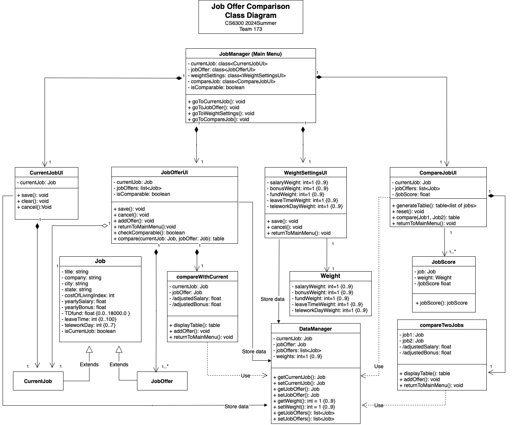
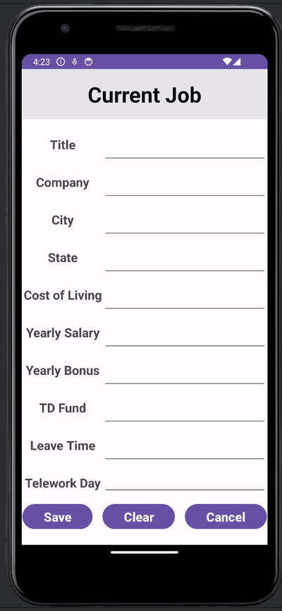
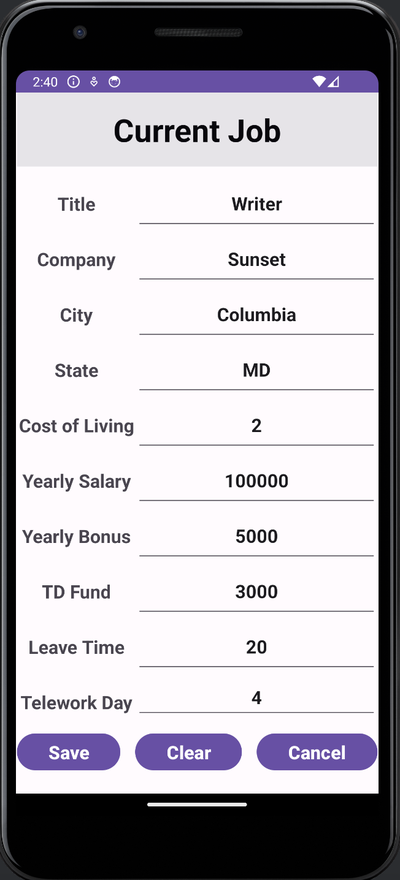
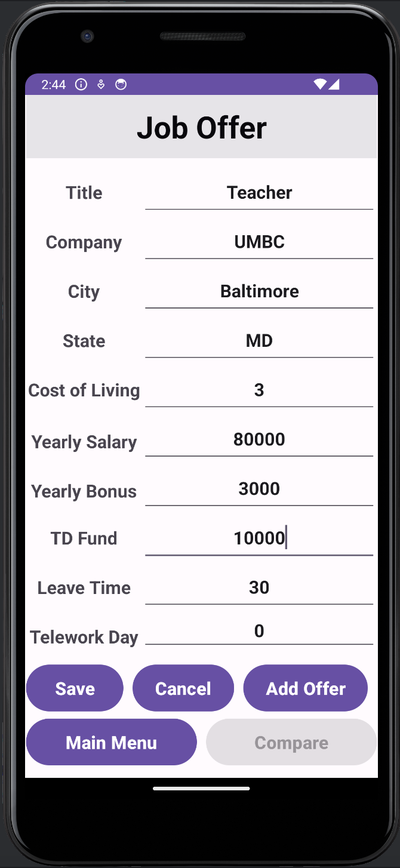
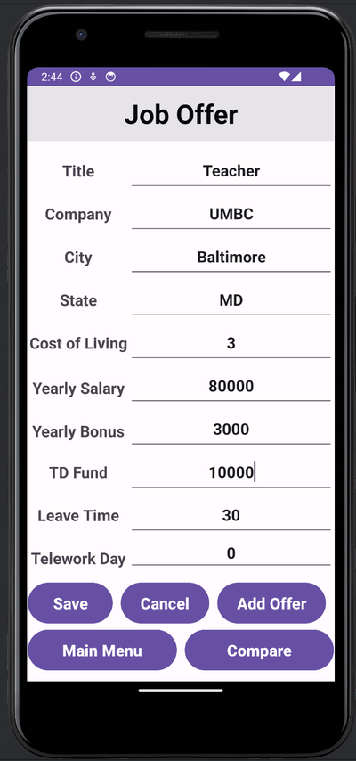
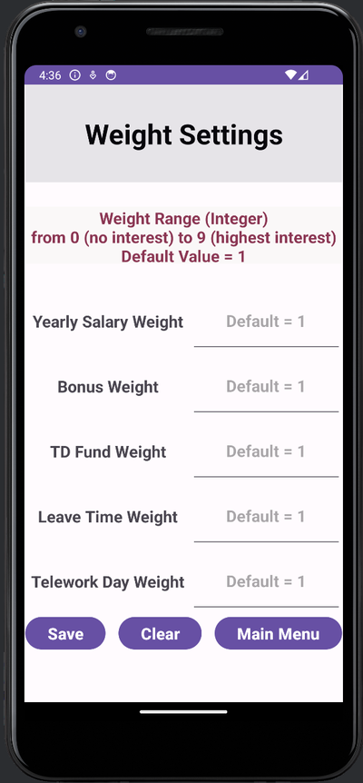
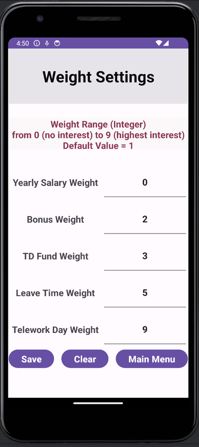
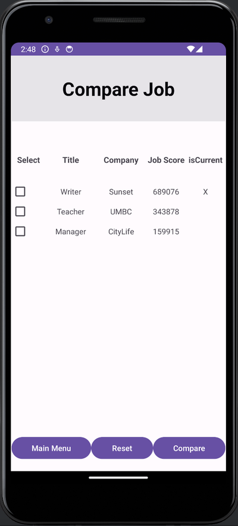
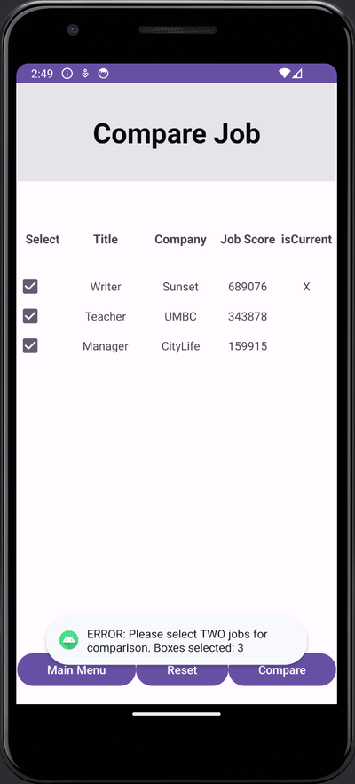
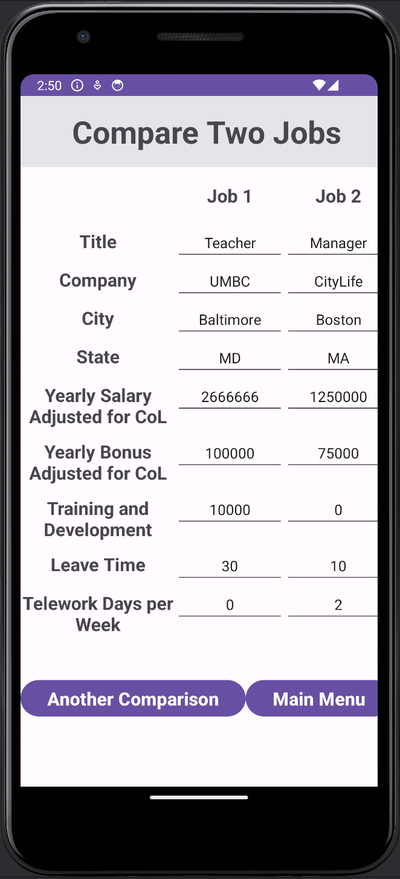

# Design Document
**Author**: _Team 173_

**Version D3**
- Updated 1.1 Assumptions to refine the content.
- Updated 3.1 Class Diagram as the team gained a deeper understanding of the app during development.
- Updated pictures in 4 User Interface Design to reflect additional interface results generated during development.

## 1 Design Considerations
### 1.1 Assumptions
- The app is expected to operates independently without requiring communication or data synchronization between devices.
- User input data is expected to be consistently valid, with no unexpected data types or formats.
- Users will not attempt to save duplicate entries to prevent redundancy.

### 1.2 Constraints
- The app is designed for single-user use.
- The app only supports Android phones running version 13 or later.
- The app requires a device with touchscreen functionality.
- Once the input data is saved, it will be stored in the app until app deletion.
- User can edit current job details but not the job offers.

### 1.3 System Environment
- The app is built on Android Studio Hedgehog with Java 17.
- Minimum SDK: "API 33: Android 13"
- Build configuration language: “Groovy DSL (build.gradle)
- Gradle (8.2) and Android Gradle Plugin versions (8.2.x) compatible with Java 17.

## 2 Architectural Design
### 2.1 Component Diagram

The `JobManager` EntryPoint triggers the `Primary UI` component based on user input. Data is stored in `DataManager` and retrieved from this component for further processing. The `Compare UI` component is invoked by two modules (**JobOffer** and **CompareJob**) from the `Primary UI` for data comparison. Within the `Primary UI`, the **CompareJob** module utilizes the `JobScore` component to manage user selection lists.

### 2.2 Deployment Diagram
No deployment diagrams are required for this simple app, as it features a straightforward system and a local data storage mechanism. There is no communication or data synchronization between devices.

## 3 Low-Level Design
### 3.1 Class Diagram 

When the user selects an option from the main menu, the GUI triggers the corresponding method in `JobManager`, which is the entry point class (Main Menu) that initializes and invokes primary classes (UIs): `CurrentJob`, `JobOffer`, `WeightSettings`, and `CompareJob`. 

`JobManager` has a boolean attribute ***'isComparable'*** that helps determine whether `CompareJob` should be enabled (***isComparable = True***) or disabled (***isComparable = False***). 

When `CurrentJob` is invoked, it directs the user to the `CurrentJob` interface for current job input. The **save()** method handles the save choice and directs the user back to the main menu, the **clear()** method erases the user's inputs, and the **cancel()** method handles the cancel and exit without saving choice, directing the user back to the main menu.

When `JobOffer` is invoked, it directs the user to the `JobOffer` interface for job offer input. The **save()** method handles the save choice, the **cancel()** method handles the cancel choice, and the **returnToMainMenu()** method directs the user back to the main menu. The **compare()** method invokes `compareWithCurrent` interface, which displays information in a table format comparing the current job with the latest saved job offer. 

When `WeightSettings` is invoked, it directs the user to the `WeightSettings` interface for weight value input. The default value for weights is 1, meaning that if no weights are assigned, all factors will be considered equal in later calculations. The **save()** method handles the save choice, the **cancel()** method handles the cancel and exit without saving choice, and the **returnToMainMenu()** method directs the user back to the main menu.

When `CompareJob` is invoked, it directs the user to the `CompareJob` interface for comparing two jobs. Its **generateTable()** method calls the `JobScore` class to calculate the scores and shows the ranked list of jobs for the user to select. The **reset()** method handles the cancel choice, and the **returnToMainMenu()** method directs the user back to the main menu. The **compare()** method invokes `compareTwoJobs` interface, which displays information in a table format comparing two jobs. 

`compareWithCurrent` and `compareTwoJobs` utilize the same method.  The **displayTable()** method shows the comparison results, the **addOffer()** method directs the user back to the previous interface to initiate a new comparison, and the **returnToMainMenu()** method directs the user back to the main menu.

`Job` class manages two instances: ***CurrentJob*** and ***JobOffer***, distinguished by a boolean value ***isCurrentJob*** (true for ***CurrentJob*** and false for ***JobOffer***). The `Weight` class handles weights, while `DataManager` serves as a local database, storing all system data including ***CurrentJob***, ***JobOffer***, and ***weights***.

### 3.2 Other Diagrams
No other diagrams are generated.

## 4 User Interface Design

