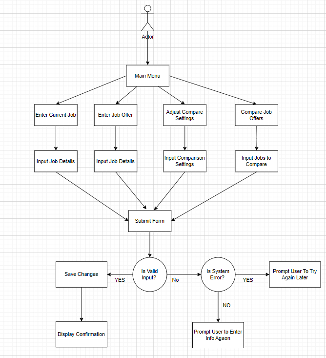

# Use Case Model

**Author**: _Team 173_

## 1 Use Case Diagram

*Note: Add Use Case Diagram*

## 2 Use Case Descriptions

### Use Case 1: Enter Current Job

- **Requirements**: Allow the user to input details about their current job, including title, company, location, and other relevant factors.
- **Pre-conditions**: The user must be on the main menu.
- **Post-conditions**: The current job details are saved in the system and available for comparison with job offers.
- **Scenarios**:
  - **Normal Scenario**:
    1. The user navigates to the "Enter Current Job" page.
    2. The user inputs the job details.
    3. The user submits the form.
    4. The system validates the input data.
    5. The system saves the current job details.
    6. The system displays a confirmation message to the user.
  - **Alternate Scenario**:
    1. Steps 1-3 as above.
    2. The system finds missing or invalid information.
    3. The system displays an error message and prompts the user to correct the information.
  - **Exceptional Scenario**:
    1. Steps 1-3 as above.
    2. The system encounters an error while saving the current job details.
    3. The system displays an error message and prompts the user to try again later.

### Use Case 2: Enter Job Offer

- **Requirements**: Allow the user to input details about a job offer, including title, company, location, and other relevant factors.
- **Pre-conditions**: The user must be on the main menu.
- **Post-conditions**: The job offer details are saved in the system and available for comparison with the current job.
- **Scenarios**:
  - **Normal Scenario**:
    1. The user navigates to the "Enter Job Offer" page.
    2. The user inputs the job offer details.
    3. The user submits the form.
    4. The system validates the input data.
    5. The system saves the job offer details.
    6. The system displays a confirmation message to the user.
  - **Alternate Scenario**:
    1. Steps 1-3 as above.
    2. The system finds missing or invalid information.
    3. The system displays an error message and prompts the user to correct the information.
  - **Exceptional Scenario**:
    1. Steps 1-3 as above.
    2. The system encounters an error while saving the job offer details.
    3. The system displays an error message and prompts the user to try again later.

### Use Case 3: Adjust Comparison Settings

- **Requirements**: Allow the user to adjust weighting for comparing job offers according to personal preferences.
- **Pre-conditions**: The user must be on the main menu of the app and have at least one job offer and current job entered.
- **Post-conditions**: The comparison settings are saved in the system and used to compare the job offers.
- **Scenarios**:
  - **Normal Scenario**:
    1. The user navigates to the "Adjust Comparison Settings" page.
    2. The user adjusts the settings to prioritize different factors.
    3. The user submits the settings form.
    4. The system validates the input data.
    5. The system saves the comparison settings.
    6. The system displays a confirmation message to the user.
  - **Alternate Scenario**:
    1. Steps 1-3 as above.
    2. The system finds missing or invalid information.
    3. The system displays an error message and prompts the user to correct the information.
  - **Exceptional Scenario**:
    1. Steps 1-3 as above.
    2. The system encounters an error while saving the comparison settings.
    3. The system displays an error message and prompts the user to try again later.

### Use Case 4: Compare Job Offers

- **Requirements**: Allow the user to compare their current job with one or more job offers based on the specified comparison settings.
- **Pre-conditions**: The user must be on the main menu and have at least one job offer and current job entered, with comparison settings adjusted.
- **Post-conditions**: The system displays a comparison of the job offers based on the user's settings.
- **Scenarios**:
  - **Normal Scenario**:
    1. The user navigates to the "Compare Job Offers" page.
    2. The user selects the job offers to compare.
    3. The user submits the comparison request.
    4. The system retrieves the current job, job offers, and comparison settings from the database.
    5. The system performs the comparison based on the settings.
    6. The system displays the comparison results to the user.
  - **Alternate Scenario**:
    1. Steps 1-3 as above.
    2. The system finds that required data (current job, job offers, or comparison settings) is missing.
    3. The system displays an error message and prompts the user to complete the necessary steps.
  - **Exceptional Scenario**:
    1. Steps 1-3 as above.
    2. The system encounters an error while retrieving data or performing the comparison.
    3. The system displays an error message and prompts the user to try again later.
