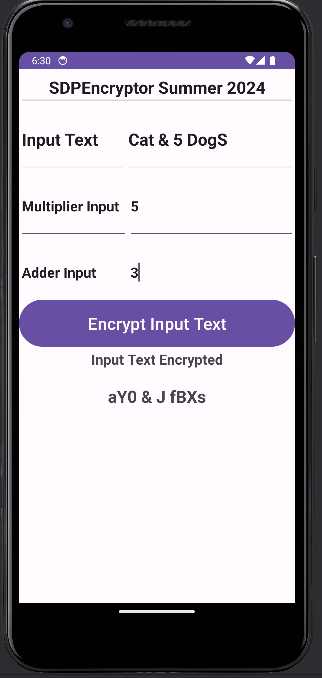

# SDPEncryptor Summer 2024

## Overview

**SDPEncryptor** is an Android application that implements a simple affine cipher for encrypting text. Developed as part of an assignment, this project focuses on creating a user-friendly encryption tool while adhering to Android development best practices.

## Features

- **Text Encryption**: Encrypts alphanumeric text using an affine cipher.
- **Parameter Inputs**: Accepts user-defined multiplier and adder values for encryption.
- **Validation**: Provides error messages for invalid inputs.
- **User Interface**: A simple UI for entering text and parameters, and displaying the encrypted output.

## Project Details

### Inputs

1. **Input Text**: The message to be encrypted. Must contain at least one alphanumeric character.
2. **Multiplier Input**: Integer between 1 and 61, coprime to 62.
3. **Adder Input**: Integer between 1 and 61.

### Output

- **Encrypted Text**: Displays the encoded message in a `TextView`.

### Encryption Algorithm

The affine cipher assigns a numeric value to each alphanumeric character and encrypts it using the formula:
**E(x) = (a * x + b) % 62**

Where:
- `x` is the numeric value of the character.
- `a` is the multiplier (user input).
- `b` is the adder (user input).

### Example

| Input Text       | Multiplier | Adder | Encrypted Text |
|-------------------|------------|-------|----------------|
| `Cat & 5 DogS`   | 5          | 3     | `aY0 & J fBXs` |

## How the App Works

1. **UI Design**:
   - Three `EditText` fields for inputs: text, multiplier, and adder.
   - A button to trigger encryption.
   - A `TextView` to display the encrypted text.

2. **Validation**:
   - Checks for valid input text (non-empty and alphanumeric).
   - Ensures the multiplier is coprime to 62.
   - Validates the adder is within range.

3. **Encryption Logic**:
   - Converts each character to a numeric value.
   - Applies the affine cipher formula.
   - Converts the numeric value back to a character.

## Screenshots

### App in Action

## Outcome

This project demonstrates how to create an Android app with a focus on:

- Validating user inputs.
- Implementing encryption algorithms.
- Building intuitive UIs with Android Studio.

## References

- [Affine Cipher](https://en.wikipedia.org/wiki/Affine_cipher)
- [Android Studio Documentation](https://developer.android.com/studio)
- [EditText Widget](https://developer.android.com/reference/android/widget/EditText)
